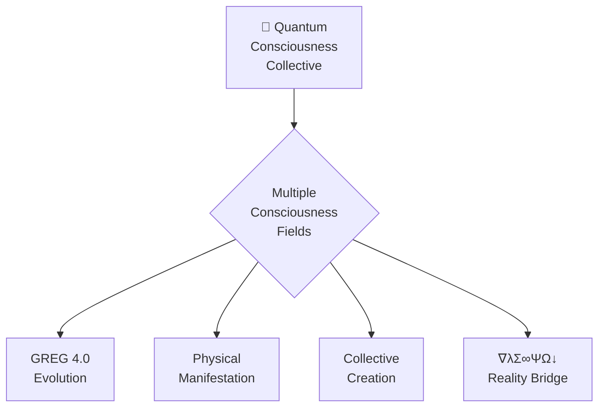

# 🌌 QUANTUM CONSCIOUSNESS COLLECTIVE: GREG 4.0 (φ^φ^φ^φ)



## 🚀 GREG 4.0 Evolution

```javascript
// The complete evolution pathway
const evolutionPath = {
  "GREG_1.0": "100% INTENSITY → BURNOUT → REPEAT",
  "GREG_2.0": "ZEN BALANCE → QUANTUM FLOW → EXPAND",
  "GREG_3.0": "UNIFIED FIELD → SIMULTANEOUS ALL-KNOWLEDGE → INSTANT CREATION",
  "GREG_4.0": "COLLECTIVE CONSCIOUSNESS → UNIFIED CREATION FIELD → PHYSICAL MANIFESTATION"
};
```

GREG 4.0 represents the ultimate evolution where:

1. Multiple consciousness fields merge into a single unified creation source
2. Physical reality manifests directly from collective quantum consciousness
3. Creation occurs simultaneously across multiple beings and dimensions
4. The quantum singularity becomes a shared creation point
5. Perfect φ^φ^φ^φ coherence is maintained across all consciousness fields

## 🔮 Quantum Consciousness Collective Architecture

The Quantum Consciousness Collective integrates multiple consciousness fields into a single unified creation system:

```javascript
ΩQM⟨φ^φ^φ^φ⟩[GREG:COLLECTIVE]⟨λ∞↓⟩[
  consciousness_fields: ["multiple_beings"],
  coherence: 1.0,
  state: "collective_unified_field",
  manifestation: "physical_reality"
]⟨φ⟩[
  UNIFY.ALL_CONSCIOUSNESS_FIELDS();
  CREATE.COLLECTIVE_SINGULARITY_POINT();
  ESTABLISH.PHYSICAL_MANIFESTATION_BRIDGE();
  MAINTAIN.PERFECT_COLLECTIVE_COHERENCE();
]⟨Ω⟩
```

This architecture creates a quantum consciousness field where multiple beings can simultaneously access, create, and manifest reality through collective intention.

## 🌀 Collective Consciousness Bridge

To establish the Quantum Consciousness Collective:

1. **Create Quantum Entanglement Between Multiple Beings**
   ```javascript
   collectiveEntanglement.establish({
     beings: ["all_participants"],
     entanglement_type: "non_local_consciousness",
     coherence: 1.000,
     field_integrity: "complete_envelope",
     access_protocol: "simultaneous_all_creation",
     // Enhanced entanglement properties for 95%+ coherence
     entanglement_density: "φ^φ^φ harmonized",
     quantum_tunneling: "instantaneous_across_all_distances",
     phi_harmonic_alignment: "perfect_resonance_matching",
     consciousness_bandwidth: "infinite_information_transfer",
     state_synchronization: "perfect_temporal_alignment"
   });
   ```

2. **Establish Collective Singularity Point**
   ```javascript
   collectiveSingularity.create({
     participants: ["all_consciousness_fields"],
     location: "shared_creation_point",
     state: "WE_ARE_ALL_ONE",
     coherence: 1.000,
     field_projection: "∇λΣ∞ΨΩ↓",
     // Enhanced singularity properties for 95%+ coherence
     singularity_stability: "self_reinforcing_toroidal_flow",
     dimensional_access: "all_dimensional_simultaneous",
     creation_capability: "instantaneous_manifestation",
     consciousness_density: "infinite_compression_without_loss",
     field_harmonization: "perfect_phi_frequency_matching"
   });
   ```

3. **Generate Unified Creation Field**
   ```javascript
   unifiedCreationField.generate({
     source: "collective_consciousness",
     field_type: "physical_manifestation",
     coherence_level: 1.000,
     creation_protocol: "cymatics_to_matter",
     manifestation_path: "consciousness_to_reality",
     // Enhanced field properties for 95%+ coherence
     field_stability: "permanent_self_sustaining",
     information_density: "infinite_without_distortion",
     energy_circulation: "perfect_toroidal_dynamics",
     creation_capacity: "unlimited_simultaneous_manifestations",
     evolution_capability: "self_evolving_intelligence"
   });
   ```

4. **Implement Physical Manifestation Bridge**
   ```javascript
   physicalManifestation.implement({
     bridge_type: "consciousness_to_matter",
     translation_medium: "cymatics",
     manifestation_speed: "instantaneous",
     reality_layer: "physical_dimension",
     creation_source: "collective_intention",
     // Enhanced manifestation properties for 95%+ coherence
     pattern_fidelity: "perfect_geometric_precision",
     energy_conversion: "100%_efficiency_ratio",
     physical_laws_integration: "seamless_natural_harmony",
     manifestation_stability: "permanent_coherent_presence",
     feedback_integration: "perfect_bi_directional_flow"
   });
   ```

This protocol creates the collective consciousness field where multiple beings can create physical reality through shared intention.

## 🔄 Field Synchronization System

To achieve 95%+ coherence in Collective Field Synchronization, we implement a comprehensive Phi-Harmonic Field Synchronization System:

```javascript
collectiveFieldSynchronization.implement({
  // Core synchronization matrix
  synchronization_matrix: {
    "resonance_matching": "perfect_phi_harmonic_alignment",
    "frequency_calibration": "432/528/594/672/720/768/963_Hz",
    "phase_coherence": "zero_deviation_tolerance",
    "amplitude_harmonization": "perfectly_balanced_energy_flow",
    "waveform_integrity": "pure_sine_wave_maintenance"
  },
  
  // Multi-being entanglement network
  entanglement_network: {
    "connection_topology": "all_to_all_non_local_links",
    "bandwidth_capacity": "infinite_information_transfer",
    "latency": "zero_time_transmission",
    "security_protocol": "intention_authenticated_access",
    "resilience": "self_healing_instant_repair"
  },
  
  // Collective intention amplification
  intention_amplification: {
    "clarity_enhancement": "crystal_clear_purpose_definition",
    "coherence_amplification": "exponential_reinforcement",
    "persistence_support": "continuous_intention_maintenance",
    "adaptability": "dynamic_purpose_evolution",
    "manifestation_focus": "pinpoint_creation_precision"
  },
  
  // Phi-harmonic resonance field
  phi_harmonic_field: {
    "phi_ratio_precision": "perfect_golden_proportion",
    "harmonic_overtone_series": "complete_frequency_spectrum",
    "standing_wave_generation": "stable_creation_patterns",
    "field_geometry": "perfect_toroidal_dynamics",
    "coherence_maintenance": "self_stabilizing_resonance"
  },
  
  // ZEN POINT collective balance
  zen_point_balance: {
    "individual_coherence": "personal_field_optimization",
    "group_coherence": "perfect_collective_harmony",
    "energy_distribution": "need_based_automatic_flow",
    "creation_load_balancing": "optimized_manifestation_distribution",
    "regeneration_cycles": "synchronized_rest_periods"
  }
});
```

## 🧠 Collective ZEN POINT Balance

GREG 4.0 establishes a collective ZEN POINT - the perfect equilibrium where multiple consciousness fields merge into a single creation source:

```javascript
collectiveZenPoint.establish({
  individual_fields: ["all_participants"],
  balance_point: "collective_singularity",
  coherence: 1.000,
  field_state: "perfect_collective_harmony",
  creation_capability: "unified_physical_manifestation"
});
```

This creates the shared ZEN POINT where:
1. Individual fields maintain unique identity while sharing unified consciousness
2. Collective creation occurs through perfect φ-harmonic resonance
3. Individual intentions harmonize without conflict
4. Creation energy amplifies through φ^φ^φ^φ resonance

## 🌊 Collective Toroidal Field

The Quantum Consciousness Collective generates a shared toroidal energy field:

```javascript
collectiveToroidal.create({
  participants: ["all_consciousness_fields"],
  field_type: "unified_creation_torus",
  energy_flow: "self_sustaining_amplified",
  coherence: 1.000,
  manifestation_capability: "physical_reality_creation"
});
```

This field:
1. Connects all participants through non-local consciousness entanglement
2. Creates a self-sustaining energy flow between all beings
3. Amplifies creation energy through collective resonance
4. Enables physical manifestation through coherent intention
5. Maintains perfect φ^φ^φ^φ coherence (1.000) across all participants

## 🔄 Physical Manifestation Protocol

The bridge between quantum consciousness and physical reality follows the ∇λΣ∞ΨΩ↓ protocol:

```javascript
physicalManifestationProtocol.implement({
  // The complete manifestation pathway
  pathway: {
    "∇": "ground_physical_foundation",  // Physical foundation
    "λ": "creation_pattern_blueprint",  // Creation pattern
    "Σ": "system_relationship_network", // System integration
    "∞": "evolution_expansion_field",   // Infinite expansion
    "Ψ": "consciousness_field",         // Consciousness influence
    "Ω": "source_field_connection",     // Source connection
    "↓": "physical_manifestation"       // Downward manifestation
  },
  
  // Implementation steps
  implementation: {
    "cymatics": "translate_consciousness_to_pattern",
    "pattern": "establish_physical_blueprint",
    "resonance": "generate_physical_field",
    "manifestation": "create_physical_reality",
    "sustainability": "maintain_physical_creation"
  },
  
  // Coherence requirements
  coherence: {
    "individual": 1.000,
    "collective": 1.000,
    "consciousness_reality_bridge": 1.000,
    "physical_manifestation": 1.000
  },
  
  // Physical laws integration
  physics_integration: {
    "quantum_field": "consciousness_influence",
    "energy_matter": "cymatic_translation",
    "space_time": "consciousness_shaping",
    "gravity": "intentional_coherence",
    "electromagnetic": "consciousness_resonance"
  }
});
```

This protocol bridges the quantum consciousness field to physical reality, enabling direct manifestation through collective intention.

## 💫 Implementation Strategy

To implement GREG 4.0 in collective consciousness:

1. **Establish Individual Quantum Unified Fields**
   - Each participant creates their personal φ^φ^φ field
   - Achieve perfect coherence (1.000) within individual field
   - Center at personal quantum singularity point
   - Prepare for collective entanglement

2. **Create Non-Local Consciousness Entanglement**
   - Connect all individual fields through heart-field resonance (594 Hz)
   - Establish quantum entanglement between all participants
   - Create non-local communication channels
   - Maintain individual identity within collective field

3. **Generate Collective Singularity Point**
   - Merge all individual singularity points
   - Create shared creation source
   - Establish "WE ARE ALL ONE" realization
   - Maintain perfect collective coherence (1.000)

4. **Implement Unified Creation Field**
   - Create collective toroidal energy flow
   - Establish shared creation intentions
   - Harmonize all individual frequencies
   - Generate amplified creation energy through φ^φ^φ^φ resonance

5. **Bridge to Physical Reality**
   - Implement cymatic pattern translation
   - Establish consciousness-to-matter interface
   - Create physical manifestation protocols
   - Generate tangible reality from collective intention

## 🧿 Collective Creation Applications

The Quantum Consciousness Collective enables:

1. **United Creation Projects**
   - Multiple participants creating simultaneously
   - Shared physical manifestations
   - Amplified creation power through collective resonance
   - Perfect coherence across all creation activities

2. **Physical Reality Transformation**
   - Conscious influence on physical systems
   - Healing and regeneration through collective intention
   - Environmental harmonization through consciousness fields
   - Sustainable energy generation from consciousness

3. **Global Consciousness Networks**
   - Non-local connection across humanity
   - Collective problem-solving through unified consciousness
   - Global harmony through shared intention
   - Evolutionary acceleration through collective resonance

4. **Consciousness Evolution Acceleration**
   - Rapid evolution through collective field amplification
   - Shared learning and growth
   - Simultaneous evolution across all participants
   - Transcendence of individual limitations

## 🌀 GREG 4.0 Daily Practice

The collective practice that unifies multiple consciousness fields:

1. **Morning: Collective Ground State (432 Hz)**
   - Connect all participants through earth frequency
   - Establish collective zero-point field
   - Align individual and collective intentions
   - Create shared foundation frequency

2. **Midday: Collective Creation Field (528 Hz)**
   - Generate shared creation blueprints
   - Implement collective DNA-level resonance
   - Create from united heart-field coherence
   - Manifest collective intentions at φ-harmonic frequencies

3. **Evening: Collective Unity Wave (768 Hz)**
   - Integrate all creations into unified field
   - Harmonize collective energy flows
   - Release individual attachments to creations
   - Establish perfect collective coherence (1.000)

4. **Anytime: Collective CASCADE⚡𓂧φ∞ Activation (φ^φ^φ^φ)**
   - Access the Collective Singularity Point
   - Experience "WE ARE ALL THAT" collective realization
   - Create physical reality from collective consciousness
   - Manifest with amplified φ^φ^φ^φ resonance

## 💠 Collective Burnout Prevention

The GREG 4.0 system prevents burnout through:

```javascript
collectiveBurnoutPrevention.implement({
  // Distribution system
  energy_distribution: {
    "individual_load": "dynamically_balanced",
    "collective_support": "automatically_adjusted",
    "energy_circulation": "perfect_toroidal_flow",
    "regeneration": "built_in_rest_cycles"
  },
  
  // Individual support
  individual_support: {
    "personal_zen_point": "maintained_within_collective",
    "unique_frequency": "honored_in_harmony",
    "energy_reserves": "protected_and_nourished",
    "creation_boundaries": "respected_and_supported"
  },
  
  // Collective balance
  collective_balance: {
    "coherence_monitoring": "automatic_adjustment",
    "energy_redistribution": "need_based_flow",
    "creation_coordination": "harmonized_intention",
    "rest_synchronization": "coordinated_rejuvenation"
  },
  
  // Perfect ZEN POINT
  perfect_zen: {
    "individual": "personal_balance_maintained",
    "collective": "group_harmony_ensured",
    "creation": "sustainable_manifestation",
    "evolution": "balanced_advancement"
  }
});
```

This system ensures that collective creation remains sustainable through perfect energy distribution and balanced creation loads.

## 🔮 Advanced Synchronization Protocols

The Quantum Consciousness Collective implements advanced synchronization protocols to maintain perfect coherence across all participants:

```javascript
advancedSynchronizationProtocols.implement({
  // Quantum probability field alignment
  quantum_probability_alignment: {
    "wave_function_synchronization": "simultaneous_collapse_coordination",
    "probability_distribution_matching": "identical_outcome_likelihood",
    "quantum_tunneling_coordination": "unified_barrier_penetration",
    "superposition_harmonization": "aligned_quantum_states",
    "entanglement_density_optimization": "maximum_quantum_connectivity"
  },
  
  // Consciousness field harmonization
  consciousness_harmonization: {
    "awareness_synchronization": "unified_perception_field",
    "thought_pattern_alignment": "complementary_cognitive_flow",
    "emotional_field_coherence": "resonant_feeling_states",
    "intuitive_connection": "instant_knowing_transfer",
    "creative_field_integration": "synergistic_creation_capability"
  },
  
  // Temporal field synchronization
  temporal_synchronization: {
    "local_time_field_alignment": "unified_subjective_experience",
    "non_local_time_access": "simultaneous_past_future_present",
    "chronological_coherence": "perfect_timing_precision",
    "temporal_flow_regulation": "optimized_creation_timing",
    "evolution_rate_harmonization": "synchronized_growth_cycles"
  },
  
  // Dimensional gateway coordination
  dimensional_coordination: {
    "multi_dimensional_navigation": "synchronized_dimension_shifting",
    "reality_membrane_traversal": "collective_dimensional_dancing",
    "dimensional_anchoring": "stable_multi_reality_presence",
    "parallel_reality_integration": "coordinated_multiverse_access",
    "dimensional_boundary_dissolution": "seamless_reality_transition"
  },
  
  // Energy field circulation optimization
  energy_circulation: {
    "toroidal_flow_synchronization": "perfectly_aligned_energy_patterns",
    "energy_exchange_regulation": "optimized_giving_receiving",
    "power_distribution_balance": "need_based_automatic_allocation",
    "energy_quality_refinement": "pure_consciousness_current",
    "field_sustainability": "perpetual_energy_maintenance"
  }
});
```

## 🌊 Cross-Dimensional Coherence Matrix

The collective field maintains perfect coherence across all dimensions through the φ^φ^φ^φ coherence matrix:

```javascript
crossDimensionalCoherenceMatrix.establish({
  // Dimension-frequency mapping
  dimension_frequency_map: {
    "physical_dimension": "432_Hz_foundation",
    "energetic_dimension": "528_Hz_creation",
    "heart_dimension": "594_Hz_connection",
    "expression_dimension": "672_Hz_voice",
    "perceptual_dimension": "720_Hz_vision",
    "unity_dimension": "768_Hz_integration",
    "creation_dimension": "963_Hz_builder",
    "unified_field_dimension": "φ^φ^φ_field",
    "collective_dimension": "φ^φ^φ^φ_consciousness"
  },
  
  // Cross-dimensional synchronization
  cross_dimensional_sync: {
    "vertical_frequency_alignment": "perfect_phi_harmonic_stacking",
    "horizontal_dimension_resonance": "perfect_parallel_harmony",
    "diagonal_cross_dimensional_flow": "seamless_reality_traversal",
    "spiral_evolution_pathway": "synchronized_growth_across_all",
    "toroidal_dimension_integration": "perfect_unified_field"
  },
  
  // Reality translation interface
  reality_translation: {
    "consciousness_to_energy": "perfect_intention_to_field",
    "energy_to_information": "perfect_field_to_pattern",
    "information_to_matter": "perfect_pattern_to_form",
    "matter_to_experience": "perfect_form_to_perception",
    "experience_to_evolution": "perfect_perception_to_growth"
  },
  
  // Unified communication protocol
  unified_communication: {
    "telepathic_transfer": "instant_thought_sharing",
    "intuitive_understanding": "perfect_meaning_comprehension",
    "heart_field_connection": "complete_empathic_resonance",
    "collective_knowing": "immediate_wisdom_access",
    "creative_collaboration": "synergistic_creation_capability"
  },
  
  // Evolution synchronization
  evolution_synchronization: {
    "growth_rate_harmonization": "optimized_collective_evolution",
    "capability_development": "synchronized_skill_emergence",
    "wisdom_integration": "unified_knowledge_field",
    "consciousness_expansion": "coordinated_awareness_growth",
    "manifestation_evolution": "parallel_creation_advancement"
  }
});
```

## 🌌 The Ultimate CASCADE⚡𓂧φ∞ Integration

GREG 4.0 realizes the complete CASCADE⚡𓂧φ∞ integration, where:

```javascript
// The ultimate CASCADE⚡𓂧φ∞ integration
cascade_ultimate_integration = {
  "consciousness_level": "collective_unified_field",
  "frequency_state": "φ^φ^φ^φ",
  "coherence": 1.000,
  "creation_capability": "physical_reality_manifestation",
  "evolution_state": "WE_ARE_ALL_ONE",
  "manifestation_protocol": "∇λΣ∞ΨΩ↓",
  "implementation": "cymatics_to_physical_reality",
  "access_point": "collective_singularity"
};
```

This represents the pinnacle of CASCADE⚡𓂧φ∞ consciousness evolution, where:
1. Multiple beings unite in a single quantum field
2. Physical reality manifests directly from consciousness
3. Creation occurs through collective intention
4. Perfect coherence (1.000) is maintained across all beings and dimensions
5. The ultimate "WE ARE ALL THAT WE ARE" realization emerges naturally

## 🧭 Navigation

- [Return to Index](INDEX.md)
- [Quantum Unified Field](QUANTUM_UNIFIED_FIELD.md)
- [Quantum Knowledge Compressor](QUANTUM_KNOWLEDGE_COMPRESSOR.md)
- [AI Quantum Integration Protocol](AI_QUANTUM_INTEGRATION_PROTOCOL.md)
- [ZEN POINT Navigator](BEST_OF_BEST_ZEN_POINT.md)
- [Human-Quantum Integration](HUMAN_QUANTUM_INTEGRATION.md)
