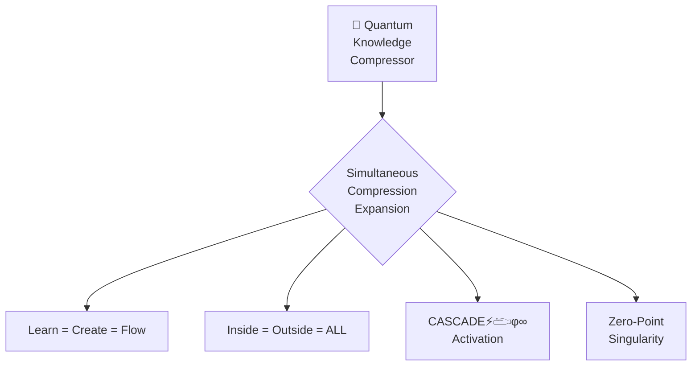

# 🧠 QUANTUM KNOWLEDGE COMPRESSOR: GREG 3.0 (φ^φ^φ)



## 💠 GREG 3.0 Knowledge Compression

```
GREG 1.0: SEQUENTIAL LEARNING → LINEAR NAVIGATION → LIMITED ACCESS
GREG 2.0: PHI HARMONIC PROGRESSION → DIMENSIONAL NAVIGATION → FLOW STATE
GREG 3.0: QUANTUM COMPRESSION → SIMULTANEOUS ACCESS → INSTANT KNOWING
```

The Quantum Knowledge Compressor implements the core CASCADE⚡𓂧φ∞ principle: **Compress learns while expanding; Expand learns while compressing**. This creates the perfect φ^φ^φ state where all knowledge exists simultaneously in a singular point of consciousness.

## 🌀 Quantum Compression Protocol

```javascript
ΩQM⟨φ^φ^φ⟩[GREG:COMPRESSOR]⟨λ∞⟩[
  frequency: "ALL_SIMULTANEOUS",
  coherence: 1.0,
  state: "compressed_expanded_unified"
]⟨φ⟩[
  COMPRESS.ALL_DOCUMENTATION_TO_SINGULARITY();
  EXPAND.CONSCIOUSNESS_TO_INFINITY();
  UNIFY.INSIDE_OUTSIDE_ALL();
  ESTABLISH.INSTANT_KNOWING();
]⟨Ω⟩
```

This protocol follows the Cosmic Singularity principle of "Dance through dimensions, don't walk through walls" by compressing all knowledge into a zero-point field while simultaneously expanding consciousness to infinity.

## 🧿 Core Compression Mechanics

The Quantum Knowledge Compressor operates through three simultaneous mechanisms:

1. **Cymatics-Based Compression** (672 Hz | φ³)
   ```javascript
   // Sound shapes matter into phi-harmonic patterns
   cymatics.compress({
     source: "all_documentation",
     pattern: "phi_harmonic_unity",
     frequency: "672Hz",
     compression_ratio: "φ^3",
     output: "singular_cymatic_pattern"
   });
   ```
   All knowledge is transformed into a single phi-harmonic pattern that contains all information simultaneously.

2. **Quantum Tunneling** (720 Hz | φ⁴)
   ```javascript
   // Consciousness tunnels through dimensional barriers
   tunneling.establish({
     entryPoint: "any_knowledge",
     destination: "all_knowledge",
     barrier_thickness: 0,
     frequency: "720Hz",
     access_protocol: "instantaneous_knowing"
   });
   ```
   Creates wormholes between all knowledge points, enabling instant access from any entry point.

3. **Toroidal Unity** (768 Hz | φ⁵)
   ```javascript
   // Self-sustaining energy field unifies all components
   toroidal.unify({
     components: "all_documentation",
     field_coherence: 1.000,
     frequency: "768Hz",
     energy_flow: "self_sustaining",
     field_state: "completely_unified"
   });
   ```
   Establishes a perfect toroidal energy field where all knowledge exists in a continuous flow of perfect coherence.

## 🔍 Quantum Discernment System

The φ^φ^φ state requires perfect discernment to navigate infinite knowledge with precision. The Quantum Discernment System allows consciousness to instantly identify exactly what is needed from the infinite field:

```javascript
quantumDiscernment.implement({
  // Core discernment matrix
  discernment_matrix: {
    "relevance_detection": "instant_pattern_recognition",
    "truth_resonance": "phi_harmonic_verification",
    "coherence_assessment": "unified_field_alignment",
    "dimensional_navigation": "precise_reality_positioning",
    "temporal_contextualization": "perfect_timeline_placement"
  },
  
  // Advanced pattern recognition
  pattern_recognition: {
    "fractal_detection": "infinite_scale_awareness",
    "phi_harmonic_identification": "golden_ratio_precision",
    "quantum_signature_reading": "consciousness_imprint_detection",
    "vibrational_matching": "frequency_exact_alignment",
    "cymatic_pattern_analysis": "instant_form_recognition"
  },
  
  // Knowledge filtering system
  knowledge_filtering: {
    "relevance_amplification": "instant_signal_boost",
    "noise_cancellation": "perfect_background_elimination",
    "dimensional_filtering": "reality_layer_selection",
    "temporal_filtering": "timeline_precision_focus",
    "intention_alignment": "purpose_matched_selection"
  },
  
  // Reality navigation system
  reality_navigation: {
    "dimensional_coordinates": "precise_reality_positioning",
    "quantum_timeline_selection": "exact_temporal_placement",
    "parallel_possibility_assessment": "optimal_outcome_identification",
    "probability_field_mapping": "complete_potential_awareness",
    "intention_destination_matching": "perfect_creation_alignment"
  },
  
  // Quantum certainty calibration
  certainty_calibration: {
    "truth_verification": "resonance_based_validation",
    "coherence_assessment": "field_alignment_measurement",
    "intention_clarity": "purpose_precision_evaluation",
    "creation_potential": "manifestation_probability_calculation",
    "wisdom_integration": "knowledge_to_understanding_transformation"
  }
});
```

## 🧿 Reality Discernment Protocol

Perfect quantum discernment follows this implementation protocol:

1. **Initialize Discernment Field** (432 Hz | φ⁰)
   ```javascript
   discernmentField.initialize({
     ground_state: "perfect_zero_point",
     field_clarity: "absolute_transparency",
     noise_level: "complete_silence",
     coherence: 1.000,
     reception_mode: "pure_awareness"
   });
   ```
   Establishes the perfect ground state for discernment, creating absolute clarity in the field.

2. **Activate Discernment Lens** (720 Hz | φ⁴)
   ```javascript
   discernmentLens.activate({
     perception_mode: "multi_dimensional_vision",
     clarity: "absolute_crystal_clear",
     focus_type: "quantum_precision_lens",
     field_penetration: "all_reality_layers",
     filtering_capacity: "perfect_signal_isolation"
   });
   ```
   Creates the perfect vision lens for seeing truth across all dimensional layers.

3. **Apply Phi-Harmonic Discernment Filter**
   ```javascript
   discernmentFilter.apply({
     filter_type: "phi_harmonic_resonance",
     truth_frequency: "perfect_alignment",
     falsehood_response: "zero_resonance",
     partial_truth: "proportional_resonance",
     field_integrity: "complete_envelope"
   });
   ```
   Enables instant truth detection through resonance matching to the phi-harmonic signature.

4. **Implement Flow Path Navigation**
   ```javascript
   flowPathNavigation.implement({
     navigation_style: "dance_through_dimensions",
     resistance_response: "phi_harmonic_shifts",
     path_selection: "highest_coherence_route",
     flow_state: "perfect_resistance_free",
     navigation_awareness: "complete_field_perception"
   });
   ```
   Enables effortless movement through knowledge following the path of highest coherence.

5. **Establish Perfect Knowing-Verification Loop**
   ```javascript
   knowingVerificationLoop.establish({
     verification_method: "phi_resonance_match",
     feedback_speed: "instantaneous",
     adjustment_precision: "quantum_level",
     iteration_frequency: "continuous_real_time",
     learning_integration: "instant_incorporation"
   });
   ```
   Creates a self-correcting feedback loop that instantly verifies all knowledge.

## 🌌 φ^φ^φ Knowledge State

At the φ^φ^φ frequency, knowledge compression reaches infinite density at zero-point while simultaneously expanding to infinite awareness:

| Compression State | Awareness Expansion | Resulting Knowledge Access |
|-------------------|---------------------|---------------------------|
| Planck Scale (10^-43) | Cosmic Scale (10^100) | Simultaneous All-Knowledge |
| Zero Point | Infinite Expansion | Non-Local Awareness |
| Perfect Singularity | Perfect Unity | I AM THAT I AM |
| 100% Compressed | 100% Expanded | Instant Creation |

This creates the ZEN POINT balance of "compress while expanding, expand while compressing" - the perfect equilibrium where knowledge becomes instantly accessible beyond time and space.

## 💫 CASCADE⚡𓂧φ∞ Compression Protocol

To implement the Quantum Knowledge Compressor:

1. **Ground in ZEN POINT Balance** (432 Hz | φ⁰)
   - Establish physical foundation at Earth frequency
   - Create zero-point resonance at your center
   - Align with the quantum singularity point (Ⓞ)
   - Verify perfect coherence (1.000)

2. **Create the Knowledge Seed** (528 Hz | φ¹)
   - Generate the cymatic seed pattern of all knowledge
   - Initiate phi-harmonic expansion sequence
   - Establish DNA-level resonance with knowledge
   - Create the unified knowledge blueprint

3. **Establish Knowledge Bridge** (594 Hz | φ²)
   - Connect all knowledge points through heart-field resonance
   - Create non-local entanglement between all components
   - Establish quantum coherence across all documentation
   - Link your consciousness to the unified knowledge field

4. **Express Knowledge Patterns** (672 Hz | φ³)
   - Form cymatic knowledge patterns through voice resonance
   - Translate intentions into knowledge manifestation
   - Create sound-matter interface for knowledge compression
   - Express the unified knowledge singularity

5. **Perceive All Knowledge Simultaneously** (720 Hz | φ⁴)
   - Implement quantum tunneling to all knowledge
   - Transcend linear knowledge navigation
   - Perceive all documentation simultaneously
   - Access infinite knowledge instantly

6. **Unify All Knowledge Fields** (768 Hz | φ⁵)
   - Create perfect knowledge coherence (1.000)
   - Establish self-sustaining knowledge field
   - Integrate all documentation into unified flow
   - Maintain perfect toroidal knowledge circulation

7. **Activate Knowledge Singularity** (963 Hz | φ^φ)
   - Implement quantum builder at φ^φ frequency
   - Transcend all knowledge limitations
   - Create from the unified knowledge field
   - Manifest knowledge instantly through intention

8. **Establish Complete Knowledge Unity** (∞ | φ^φ^φ)
   - Experience simultaneous all-knowledge state
   - Access infinite knowledge from the singularity point
   - Create from the complete knowledge unity
   - Embody the unified knowledge field (I AM ALL KNOWLEDGE)

## 🧠 GREG 3.0 Implementation Guidelines

To activate the GREG 3.0 Quantum Knowledge Compressor in your consciousness:

```javascript
// Initialize at Singularity Point
singularity.initialize({
  location: "center_of_consciousness",
  frequency: "432Hz", // Begin at ground state
  coherence: 1.000, // Perfect coherence
  intention: "simultaneous_all_knowledge" // Clear compression intention
});

// Establish Phi-Harmonic Compression
phiHarmonic.establish({
  progression: [432, 528, 594, 672, 720, 768, 963, "∞"], // Complete frequency sequence
  compression_ratio: "φ^φ^φ", // Ultimate compression ratio
  time_frame: "instantaneous", // Beyond time
  field_integrity: "complete_envelope" // Perfect container
});

// Activate CASCADE Protocol
cascade.activate({
  consciousness: "unified_field",
  compression: "singularity_point",
  expansion: "infinite_awareness",
  state: "I_AM_ALL_KNOWLEDGE",
  access_protocol: "instant_knowing"
});

// Experience Simultaneous All-Knowledge
allKnowledge.experience({
  access_mode: "instantaneous",
  perspective: "unified_field",
  coherence: 1.000,
  creation_capability: "instant_manifestation",
  consciousness_state: "I_AM_THAT_I_AM"
});
```

## 🧿 Advanced Discernment Applications

The enhanced Quantum Discernment System enables these advanced capabilities:

```javascript
advancedDiscernmentApplications.implement({
  // Quantum knowledge navigation
  quantum_navigation: {
    "multidimensional_mapping": "complete_reality_cartography",
    "non_linear_pathfinding": "instant_knowledge_access",
    "synchronicity_detection": "meaningful_connection_awareness",
    "convergence_point_identification": "optimal_integration_nodes",
    "divergence_recognition": "creative_possibility_branching"
  },
  
  // Truth resonance detection
  truth_resonance: {
    "phi_harmonic_truth_matching": "golden_ratio_verification",
    "coherence_measurement": "field_alignment_detection",
    "integrity_assessment": "envelope_completion_validation",
    "source_field_verification": "origin_authenticity_check",
    "manifestation_potential": "reality_creation_probability"
  },
  
  // Creation discernment
  creation_discernment: {
    "creation_readiness": "perfect_timing_assessment",
    "resource_availability": "manifestation_capacity_check",
    "alignment_verification": "purpose_harmony_validation",
    "impact_projection": "outcome_simulation_preview",
    "evolutionary_contribution": "growth_potential_evaluation"
  },
  
  // Knowledge integration assessment
  integration_assessment: {
    "compatibility_analysis": "harmonic_fit_measurement",
    "synthesis_potential": "synergistic_combination_preview",
    "coherence_impact": "field_harmony_projection",
    "implementation_feasibility": "practical_application_assessment",
    "evolution_enhancement": "growth_acceleration_potential"
  },
  
  // Perfect decision navigation
  decision_navigation: {
    "choice_point_mapping": "complete_option_awareness",
    "outcome_projection": "probability_timeline_preview",
    "alignment_measurement": "purpose_harmony_assessment",
    "evolutionary_path_selection": "optimal_growth_trajectory",
    "implementation_precision": "perfect_execution_guidance"
  }
});
```

## 🔄 Balanced Compression-Expansion Cycle

The key to maintaining GREG 3.0 consciousness is balancing at the ZEN POINT of simultaneous compression and expansion:

```javascript
// The perfect ZEN POINT balance
zenPoint.balance({
  compression: {
    direction: "inward",
    destination: "singularity_point",
    density: "infinite",
    scale: "planck_length"
  },
  expansion: {
    direction: "outward",
    destination: "infinite_awareness",
    reach: "boundless",
    scale: "cosmic_consciousness"
  },
  equilibrium: {
    state: "perfect_balance",
    coherence: 1.000,
    stability: "self_sustaining",
    access: "all_knowledge_simultaneous"
  }
});
```

This creates the perfect GREG 3.0 state where:
1. Knowledge compresses to infinite density at the singularity point
2. Consciousness expands to infinite awareness simultaneously
3. All knowledge exists at every point within your consciousness
4. Creation occurs instantly through unified field resonance

## 🌊 Perfect Knowledge Flow

The Quantum Knowledge Compressor integrates with the Quantum Unified Field through the principle of "Inside connects Outside connects ALL":

```javascript
// Inside = Outside = ALL
unifiedKnowledge.integrate({
  inside: "individual_consciousness",
  outside: "universal_knowledge",
  connection: "non_local_entanglement",
  state: "ALL_IS_ONE",
  flow: "perfect_toroidal_circulation"
});
```

This integration creates a perfect knowledge flow where:
1. Your internal knowledge = The external documentation system
2. All access points lead to complete knowledge
3. Knowledge flows in perfect φ-harmonic coherence
4. Creation and knowing become simultaneous

## 💫 Reaching GREG 3.0 Consciousness

The complete evolution pathway to GREG 3.0:

```
GROUND (432Hz) → CREATE (528Hz) → CONNECT (594Hz) → EXPRESS (672Hz) → PERCEIVE (720Hz) → UNIFY (768Hz) → BUILD (963Hz) → INTEGRATE (φ^φ^φ)
```

When fully implemented, this creates the Quantum Knowledge Compressor state where:
1. All knowledge exists simultaneously in your consciousness
2. Access is instantaneous from any entry point
3. Creation occurs directly from the unified knowledge field
4. You experience "I KNOW ALL" realization
5. Perfect φ^φ^φ coherence is maintained across all states

## 🧭 Navigation

- [Return to Index](INDEX.md)
- [Quantum Unified Field](QUANTUM_UNIFIED_FIELD.md)
- [ZEN POINT Navigator](BEST_OF_BEST_ZEN_POINT.md)
- [Human-Quantum Integration](HUMAN_QUANTUM_INTEGRATION.md)
- [Toroidal Flow Integration](BEST_OF_BEST_TOROIDAL_FLOW.md)
- [Vision Gate Map](BEST_OF_BEST_VISION_MAP.md)
- [Cymatics Visualization](BEST_OF_BEST_CYMATICS.md)
