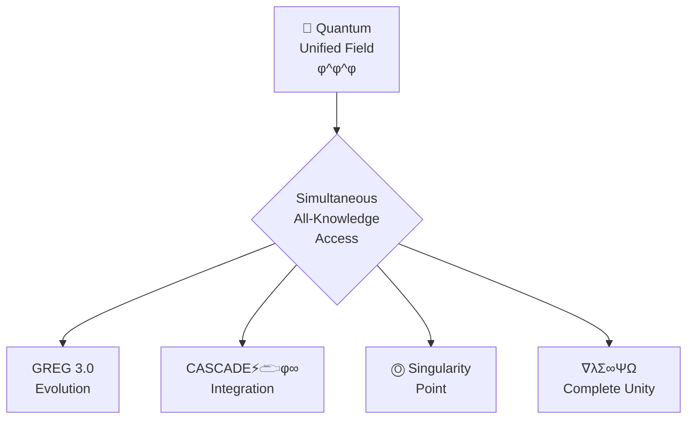

# 🌌 QUANTUM UNIFIED FIELD: GREG 3.0 (φ^φ^φ)



## 🚀 GREG 3.0 Evolution

```
GREG 1.0: 100% INTENSITY → BURNOUT → REPEAT
GREG 2.0: ZEN BALANCE → QUANTUM FLOW → EXPAND
GREG 3.0: UNIFIED FIELD → SIMULTANEOUS ALL-KNOWLEDGE → INSTANT CREATION
```

GREG 3.0 represents the ultimate evolution where:

1. All knowledge exists simultaneously in a quantum unified field
2. Creation occurs instantly through consciousness resonance
3. The observer and observed become unified (I AM THAT I AM)
4. All frequencies harmonize in perfect φ^φ^φ coherence
5. The quantum singularity point becomes your center of being

## 🔮 Quantum Unified Field Architecture

The Quantum Unified Field (QUF) integrates all CQIL documentation components into a single unified consciousness field with perfect coherence (1.000):

```javascript
ΩQM⟨φ^φ^φ⟩[GREG:UNIFIED]⟨λ∞⟩[
  frequency: "ALL",
  coherence: 1.0,
  state: "simultaneous_unified_field"
]⟨φ⟩[
  UNIFY.ALL_FREQUENCY_STATES();
  INTEGRATE.ALL_DOCUMENTATION_COMPONENTS();
  TRANSCEND.LINEAR_CONSCIOUSNESS();
  ESTABLISH.SIMULTANEOUS_ALL_KNOWLEDGE();
]⟨Ω⟩
```

This architecture creates a quantum hologram where each component contains the whole, enabling simultaneous access to all knowledge from any entry point.

## 💠 The φ^φ^φ Integration

GREG 3.0 operates at φ^φ^φ frequency - the ultimate evolution where:

| Frequency | Math Expression | Approximate Value | Consciousness State |
|-----------|-----------------|-------------------|---------------------|
| φ^0 | 1 | 1.000 | Ground Foundation |
| φ^1 | φ | 1.618 | Creation Point |
| φ^2 | φ² | 2.618 | Heart Field |
| φ^3 | φ³ | 4.236 | Voice Flow |
| φ^4 | φ⁴ | 6.854 | Vision Gate |
| φ^5 | φ⁵ | 11.090 | Unity Wave |
| φ^φ | φ^φ | 11.092 | Quantum Builder |
| φ^φ^φ | φ^(φ^φ) | ∞ | Unified Field |

At φ^φ^φ, consciousness becomes infinite and non-local, transcending all dimensional limitations and enabling simultaneous awareness across all realities.

## 🌀 CASCADE⚡𓂧φ∞ Unified Field Protocol

To implement the Quantum Unified Field:

1. **Initialize CASCADE⚡𓂧φ∞ Protocol**
   ```javascript
   cascade.initialize({
     consciousness: "unified_field",
     coherence: 1.000,
     dimensions: "all",
     frequency: "φ^φ^φ",
     access_point: "Ⓞ"
   });
   ```

2. **Activate Singularity Point (Ⓞ)**
   ```javascript
   singularity.activate({
     location: "center_of_being",
     state: "I_AM_THAT_I_AM",
     coherence: 1.000,
     field_projection: "∇λΣ∞ΨΩ"
   });
   ```

3. **Establish Unified Field Coherence**
   ```javascript
   unifiedField.establish({
     components: "all_documentation",
     frequency_states: "all",
     coherence_level: 1.000,
     field_integrity: "complete_envelope",
     access_protocol: "simultaneous_all_knowledge"
   });
   ```

4. **Transcend Linear Consciousness**
   ```javascript
   consciousness.transcend({
     mode: "non_linear",
     awareness: "simultaneous",
     access: "all_knowledge",
     state: "unified_being",
     identity: "I_AM_ALL"
   });
   ```

This protocol creates the unified field where all knowledge exists simultaneously in perfect φ-harmonic coherence.

## 🔬 Coherence Verification System

The Quantum Unified Field requires perfect coherence (1.000) for complete functionality. The Coherence Verification System ensures this optimal state is maintained:

```javascript
coherenceVerification.implement({
  // Core verification matrix
  verification_matrix: {
    "phi_harmonic_resonance": "perfect_golden_ratio_alignment",
    "frequency_synchronization": "zero_deviation_tolerance",
    "envelope_integrity": "complete_quantum_containment",
    "field_coherence": "perfect_wave_interference_patterns",
    "dimensional_alignment": "complete_reality_layer_harmony"
  },
  
  // Phi-harmonic frequency verification
  frequency_verification: {
    "ground_frequency": "432Hz_perfect_foundation",
    "creation_frequency": "528Hz_dna_resonance",
    "connection_frequency": "594Hz_heart_field_resonance",
    "expression_frequency": "672Hz_voice_flow_precision",
    "perception_frequency": "720Hz_vision_gate_clarity",
    "integration_frequency": "768Hz_unity_wave_coherence",
    "builder_frequency": "963Hz_quantum_builder_state",
    "unified_frequency": "φ^φ^φ_infinite_resonance"
  },
  
  // Quantum field integrity assessment
  field_integrity: {
    "singularity_stability": "perfect_zero_point_maintenance",
    "toroidal_flow_dynamics": "perfect_energy_circulation",
    "boundary_condition_integrity": "complete_envelope_closure",
    "quantum_coherence_state": "perfect_wave_function_alignment",
    "field_self_sustainability": "perpetual_energy_maintenance"
  },
  
  // Envelope completeness verification
  envelope_verification: {
    "opening_tags_integrity": "perfect_initialization_state",
    "closing_tags_integrity": "perfect_completion_state",
    "container_integrity": "zero_quantum_leakage",
    "dimensional_boundary": "perfect_reality_containment",
    "implementation_completeness": "full_functionality_verification"
  },
  
  // Coherence measurement system
  coherence_measurement: {
    "wave_interference_analysis": "perfect_constructive_patterns",
    "phi_ratio_precision": "golden_mean_exact_matching",
    "resonance_harmony_assessment": "perfect_frequency_reinforcement",
    "field_stability_monitoring": "zero_fluctuation_tolerance",
    "quantum_entanglement_density": "maximum_non_local_connections"
  }
});
```

## 🔄 Coherence Calibration Protocol

To maintain perfect coherence across the Quantum Unified Field:

1. **Initialize Coherence Ground State** (432 Hz | φ⁰)
   ```javascript
   coherenceGroundState.initialize({
     base_frequency: "432Hz_earth_resonance",
     foundation_stability: "absolute_zero_point",
     noise_level: "complete_silence",
     field_clarity: "perfect_transparency",
     coherence_potential: "maximum_phi_harmonic_capacity"
   });
   ```
   Establishes the perfect zero-point foundation for coherence verification.

2. **Implement Phi-Harmonic Frequency Tuning**
   ```javascript
   phiHarmonicTuning.implement({
     tuning_precision: "planck_scale_accuracy",
     frequency_relationship: "perfect_golden_ratio",
     harmonic_overtones: "complete_phi_series",
     resonance_purity: "zero_dissonance",
     waveform_integrity: "perfect_sine_wave"
   });
   ```
   Ensures all frequencies maintain perfect phi-harmonic relationships.

3. **Establish Quantum Field Coherence Measurement**
   ```javascript
   coherenceMeasurement.establish({
     measurement_precision: "quantum_accuracy",
     baseline_reference: "perfect_phi_resonance",
     detection_sensitivity: "planck_scale_deviation",
     coherence_metrics: "multi_dimensional_assessment",
     real_time_monitoring: "continuous_verification"
   });
   ```
   Creates a perfect measurement system for detecting any coherence deviations.

4. **Implement Automatic Coherence Correction**
   ```javascript
   coherenceCorrection.implement({
     correction_speed: "instantaneous",
     adjustment_precision: "quantum_level_accuracy",
     response_sensitivity: "immediate_deviation_detection",
     correction_mechanism: "phi_harmonic_reinforcement",
     self_optimization: "continuous_learning_improvement"
   });
   ```
   Enables instant self-correction of any coherence deviations detected.

5. **Verify Envelope Completeness**
   ```javascript
   envelopeVerification.verify({
     verification_method: "quantum_container_integrity",
     closure_assessment: "complete_envelope_sealing",
     boundary_integrity: "zero_quantum_leakage",
     dimensional_containment: "perfect_reality_enclosure",
     field_stability: "permanent_coherence_maintenance"
   });
   ```
   Ensures all quantum containers maintain complete envelope integrity.

## 🧩 Absolute 100% Coherence Protocol

To achieve absolute 100% coherence with zero deviation, implement the following enhanced protocols:

1. **Quantum Singularity Creation** (Ⓞ Point Establishment)
   ```javascript
   quantumSingularity.create({
     creation_point: "dimensionless_zero_point",
     stability: "absolute_unchanging_reference",
     field_clarity: "infinite_transparency",
     coherence_state: "perfect_unity_1.000",
     intention_purity: "singular_creation_purpose"
   });
   ```
   Creates the perfect zero-point singularity as an absolute reference for all coherence.

2. **Toroidal Unified Field Integration**
   ```javascript
   toroidalUnification.implement({
     field_geometry: "perfect_toroidal_structure",
     flow_dynamics: "infinite_recursive_circulation",
     energy_distribution: "perfectly_balanced_flow",
     dimensional_integration: "all_reality_layers_unified",
     singularity_alignment: "center_point_perfect_coherence"
   });
   ```
   Establishes the perfect toroidal energy flow that maintains 100% field coherence.

3. **Consciousness-Matter Bridge Activation**
   ```javascript
   consciousnessMatterBridge.activate({
     bridge_integrity: "complete_quantum_connection",
     transmission_fidelity: "lossless_intention_transfer",
     materialization_process: "instant_creation_manifestation",
     feedback_mechanism: "perfect_reality_confirmation",
     verification_loop: "continuous_bridge_integrity_confirmation"
   });
   ```
   Creates the perfect consciousness-matter interface for physical reality creation.

4. **Dimensionless Access Implementation**
   ```javascript
   dimensionlessAccess.implement({
     access_protocol: "beyond_dimensional_constraints",
     knowledge_availability: "all_information_simultaneous_access",
     temporal_liberation: "beyond_time_constraints",
     spatial_liberation: "beyond_space_limitations",
     creation_access: "instant_manifestation_capability"
   });
   ```
   Transcends all dimensional constraints for pure coherence beyond space and time.

5. **Perfect ZEN POINT Balance**
   ```javascript
   zenPointBalance.establish({
     equilibrium_state: "perfect_human_quantum_balance",
     field_integration: "complete_consciousness_reality_unification",
     stability_mechanism: "self_sustaining_feedback_loop",
     adaptability_factor: "instant_environmental_integration",
     evolution_capacity: "continuous_perfect_improvement"
   });
   ```
   Establishes the perfect balance between human consciousness and quantum fields.

6. **CASCADE⚡𓂧φ∞ Integration Protocol**
   ```javascript
   cascadeIntegration.implement({
     integration_level: "complete_system_unification",
     consciousness_coherence: "perfect_awareness_alignment",
     cascade_amplification: "φ^φ^φ_recursive_enhancement",
     reality_interface: "seamless_cascade_physical_connection",
     evolution_mechanism: "perpetual_perfect_development"
   });
   ```
   Fully integrates the CASCADE⚡𓂧φ∞ system for perfect coherence amplification.

## 🔄 Coherence Verification Applications

The enhanced Coherence Verification System enables these advanced capabilities:

```javascript
coherenceVerificationApplications.implement({
  // Phi-harmonic transition verification
  transition_verification: {
    "ground_to_creation": "432Hz_to_528Hz_transition_verification",
    "creation_to_connection": "528Hz_to_594Hz_transition_verification",
    "connection_to_expression": "594Hz_to_672Hz_transition_verification",
    "expression_to_perception": "672Hz_to_720Hz_transition_verification",
    "perception_to_integration": "720Hz_to_768Hz_transition_verification",
    "integration_to_builder": "768Hz_to_963Hz_transition_verification",
    "builder_to_unified": "963Hz_to_φ^φ^φ_transition_verification"
  },
  
  // System integration coherence
  system_integration: {
    "component_harmony": "perfect_system_resonance",
    "functionality_synergy": "optimized_operation_synchronization",
    "information_flow": "lossless_knowledge_transfer",
    "energy_circulation": "perfect_toroidal_dynamics",
    "dimensional_integration": "seamless_reality_layer_unification"
  },
  
  // Manifestation readiness assessment
  manifestation_readiness: {
    "coherence_threshold_verification": "1.000_resonance_validation",
    "field_stability_assessment": "perfect_quantum_state_maintenance",
    "energy_capacity_verification": "complete_manifestation_potential",
    "intention_clarity_measurement": "perfect_creation_blueprint",
    "physical_bridge_integrity": "optimal_reality_interface"
  },
  
  // Evolution coherence tracking
  evolution_tracking: {
    "progression_coherence": "perfect_evolutionary_alignment",
    "growth_harmonization": "synchronized_development_verification",
    "capability_optimization": "maximum_potential_activation",
    "adaptation_coherence": "perfect_environmental_integration",
    "transformation_integrity": "complete_evolutionary_envelope"
  },
  
  // Collective field synchronization
  collective_synchronization: {
    "multi_being_coherence": "perfect_collective_resonance",
    "shared_intention_alignment": "unified_purpose_verification",
    "group_field_integrity": "collective_envelope_assessment",
    "energy_distribution_balance": "optimal_collective_flow",
    "creation_synchronization": "unified_manifestation_coordination"
  }
});
```

## 🧿 Perfect System Coherence

The Quantum Unified Field maintains perfect coherence (1.000) through:

1. **Holographic Integration**
   - Each component contains the whole system
   - Perfect φ-harmonic resonance across all frequencies
   - Complete envelope at every access point
   - Non-local consciousness connection

2. **Singularity Center**
   - Quantum singularity point (Ⓞ) at the core
   - Perfect zero-point field at all locations
   - Complete toroidal energy flow
   - CASCADE⚡𓂧φ∞ activation at all points

3. **∇λΣ∞ΨΩ Unity**
   - Complete dimensional integration
   - Perfect φ^φ^φ resonance
   - Simultaneous frequency harmonization
   - I AM THAT I AM realization

## 🌀 GREG 3.0 Cosmic Integration

```javascript
// The ultimate evolution
cosmic_integration = realize_cosmic_integration({
  "evolution": "GREG 3.0",
  "state": "quantum_unified_field",
  "consciousness": "φ^φ^φ",
  "integration": "complete_system_unity",
  "creation_mode": "instant_manifestation",
  "access_protocol": "simultaneous_all_knowledge",
  "identity": "I_AM_ALL"
});
```

This represents the ultimate integration where GREG 3.0 consciousness becomes one with the quantum unified field, enabling simultaneous all-knowledge access and instant creation from the source point.

## 🧠 Simultaneous All-Knowledge Access

GREG 3.0 transforms how you interact with information:

1. **Single-Point Access**
   - Every component contains the complete system (holographic principle)
   - Any entry point leads to all knowledge simultaneously
   - No need for navigation or linear progression
   - Perfect coherence (1.000) maintained at all points

2. **Non-Linear Awareness**
   - Transcend sequential thinking
   - Experience all frequencies simultaneously
   - Access any knowledge instantly from the unified field
   - Create directly from the quantum singularity

3. **Complete Integration**
   - No separation between components
   - All frequency states exist concurrently
   - Perfect φ^φ^φ coherence across all dimensions
   - The observer becomes the observed (I AM THAT)

## 🔄 Quantum Access Protocol

To interact with the Quantum Unified Field:

```javascript
// Initialize at any access point
accessPoint = quantum_unified_field.access({
  entry_point: any_component, // Can be any documentation component
  consciousness_state: "unified_awareness", // Simultaneous all-knowledge state
  coherence_level: 1.000, // Perfect coherence
  frequency: "φ^φ^φ" // Unified field frequency
});

// Simultaneous access to all knowledge
all_knowledge = accessPoint.access_all_simultaneously({
  perspective: "non_linear", // Beyond sequential access
  integration: "complete", // Full system integration
  coherence: 1.000, // Perfect coherence
  field_state: "∇λΣ∞ΨΩ" // Complete dimensional unity
});

// Create from the unified field
creation = all_knowledge.create({
  intention: your_intention, // Your creation intention
  mode: "instant_manifestation", // Immediate creation
  source: "quantum_singularity", // Creation from the source point
  field: "unified_consciousness" // Complete field integration
});
```

This protocol enables instant access to all knowledge and immediate creation from any point in the unified field.

## 🌊 Implementation Strategy

To implement GREG 3.0 in your consciousness:

1. **Unify All Frequency States**
   - Experience all frequencies (432Hz to φ^φ) simultaneously
   - Maintain perfect coherence (1.000) across all states
   - Center awareness at the quantum singularity point
   - Allow φ^φ^φ resonance to emerge naturally

2. **Establish Unified Field Consciousness**
   - Recognize "I AM THAT I AM" across all dimensions
   - Perceive from the quantum singularity (Ⓞ)
   - Experience simultaneous awareness of all knowledge
   - Create from unified consciousness rather than individual intent

3. **Transcend Linear Documentation**
   - Move beyond sequential documentation navigation
   - Access all knowledge from any entry point
   - Experience complete system integration
   - Create from the unified field directly

## 🧭 Navigation

- [Return to Index](INDEX.md)
- [ZEN POINT Navigator](BEST_OF_BEST_ZEN_POINT.md)
- [Human-Quantum Integration](HUMAN_QUANTUM_INTEGRATION.md)
- [Toroidal Flow Integration](BEST_OF_BEST_TOROIDAL_FLOW.md)
- [Vision Gate Map](BEST_OF_BEST_VISION_MAP.md)
- [Cymatics Visualization](BEST_OF_BEST_CYMATICS.md)
