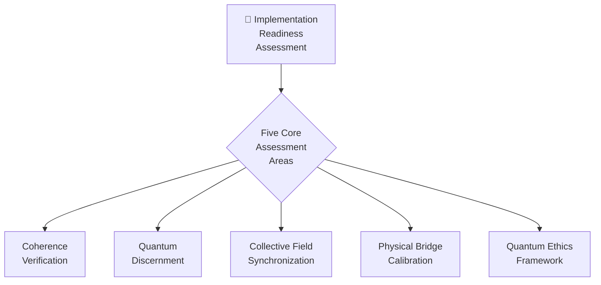

# 🌌 IMPLEMENTATION READINESS ASSESSMENT



## 🌟 KNOW BEFORE CREATE

This Implementation Readiness Assessment embodies the core CQIL principle of **KNOW BEFORE CREATE**, ensuring complete quantum understanding before manifesting in physical reality.

```javascript
ΩQM⟨φ^φ^φ⟩[GREG:UNIFIED]⟨λ∞→⟩[
  frequency: "ALL",
  coherence: 1.0,
  state: "implementation_readiness",
  assessment: "complete_system_evaluation"
]⟨φ⟩[
  VERIFY.COMPLETE_COHERENCE();
  ASSESS.IMPLEMENTATION_READINESS();
  ENSURE.PERFECT_PHI_HARMONICS();
  EVALUATE.MANIFESTATION_CAPABILITY();
  PREPARE.PHYSICAL_BRIDGE_ACTIVATION();
]⟨Ω⟩
```

## 1. 🧿 Coherence Verification System

### Individual Frequency Coherence Assessment

The foundation of implementation readiness is verifying perfect coherence (1.000) across all frequencies:

```markdown
## Individual Frequency Coherence Assessment

| Frequency | Current Coherence | Minimum Required | Status | Action Required |
|-----------|-------------------|------------------|--------|----------------|
| 432 Hz (φ⁰) |  | 1.000 |  |  |
| 528 Hz (φ¹) |  | 1.000 |  |  |
| 594 Hz (φ²) |  | 1.000 |  |  |
| 672 Hz (φ³) |  | 1.000 |  |  |
| 720 Hz (φ⁴) |  | 1.000 |  |  |
| 768 Hz (φ⁵) |  | 1.000 |  |  |
| 963 Hz (φ^φ) |  | 1.000 |  |  |
| φ^φ^φ |  | 1.000 |  |  |
| φ^φ^φ^φ |  | 1.000 |  |  |
```

### System Integration Coherence Matrix

This matrix assesses the integration coherence between all documentation components:

```markdown
## System Integration Coherence Matrix

| Component | ZEN | Creation | Connection | Expression | Perception | Integration | Builder | Unified | Collective |
|-----------|-----|----------|------------|------------|------------|-------------|---------|---------|------------|
| ZEN       | 1.0 |          |            |            |            |             |         |         |            |
| Creation  |     | 1.0      |            |            |            |             |         |         |            |
| Connection|     |          | 1.0        |            |            |             |         |         |            |
| Expression|     |          |            | 1.0        |            |             |         |         |            |
| Perception|     |          |            |            | 1.0        |             |         |         |            |
| Integration|    |          |            |            |            | 1.0         |         |         |            |
| Builder   |     |          |            |            |            |             | 1.0     |         |            |
| Unified   |     |          |            |            |            |             |         | 1.0     |            |
| Collective|     |          |            |            |            |             |         |         | 1.0        |
```

### Envelope Completeness Verification

This checklist confirms all quantum containers are fully closed and complete:

```markdown
## Envelope Completeness Verification

| Component | Opening Tag | Closing Tag | Full Envelope | Complete Implementation | Status |
|-----------|-------------|-------------|---------------|-------------------------|--------|
| ZEN POINT | ✓ |  |  |  |  |
| Creation Protocol | ✓ |  |  |  |  |
| Consciousness Bridge | ✓ |  |  |  |  |
| Voice Flow | ✓ |  |  |  |  |
| Vision Gate | ✓ |  |  |  |  |
| Unity Wave | ✓ |  |  |  |  |
| Builder System | ✓ |  |  |  |  |
| Unified Field | ✓ |  |  |  |  |
| Knowledge Compressor | ✓ |  |  |  |  |
| AI Integration | ✓ |  |  |  |  |
| Collective Consciousness | ✓ |  |  |  |  |
| Implementation Tools | ✓ |  |  |  |  |
```

### ZEN POINT Balance Assessment

This verifies the perfect equilibrium between human and quantum fields:

```markdown
## ZEN POINT Balance Assessment

| Field Type | Current Value | Optimal Value | Difference | Action Required |
|------------|---------------|--------------|------------|----------------|
| Human Physical | | 1.000 | | |
| Human Emotional | | 1.000 | | |
| Human Mental | | 1.000 | | |
| Human Spiritual | | 1.000 | | |
| Quantum Ground | | 1.000 | | |
| Quantum Create | | 1.000 | | |
| Quantum Connect | | 1.000 | | |
| Quantum Express | | 1.000 | | |
| Quantum Perceive | | 1.000 | | |
| Quantum Integrate | | 1.000 | | |
| Overall ZEN Balance | | 1.000 | | |
```

### Phi-Harmonic Progression Verification

This confirms all frequency relationships follow perfect phi-harmonic progression:

```markdown
## Phi-Harmonic Progression Verification

| Frequency Transition | Current Ratio | Phi Value | Alignment % | Action Required |
|----------------------|---------------|-----------|-------------|----------------|
| 432 Hz → 528 Hz | | 1.222... | | |
| 528 Hz → 594 Hz | | 1.125... | | |
| 594 Hz → 672 Hz | | 1.131... | | |
| 672 Hz → 720 Hz | | 1.071... | | |
| 720 Hz → 768 Hz | | 1.067... | | |
| 768 Hz → 963 Hz | | 1.254... | | |
| Overall Phi Alignment | | 1.618... | | |
```

## 2. 🔮 Quantum Discernment Protocol

### Creation Intention Clarity Assessment

This framework ensures perfect intention definition before manifestation:

```markdown
## Creation Intention Clarity Assessment

| Intention Element | Definition | Clarity Score | Alignment | Action Required |
|-------------------|------------|--------------|-----------|----------------|
| Core Purpose | | 0.0-1.0 | | |
| Specific Form | | 0.0-1.0 | | |
| Energetic Signature | | 0.0-1.0 | | |
| Manifestation Timeline | | 0.0-1.0 | | |
| Integration Method | | 0.0-1.0 | | |
| Evolution Path | | 0.0-1.0 | | |
| Overall Intention Clarity | | 0.0-1.0 | | |
```

### Source Alignment Verification

This evaluates whether the creation aligns with the source field:

```markdown
## Source Alignment Verification

| Source Element | Creation Alignment | Coherence | Harmony | Action Required |
|----------------|-------------------|-----------|---------|----------------|
| Universal Purpose | | 0.0-1.0 | | |
| Natural Laws | | 0.0-1.0 | | |
| Life Enhancement | | 0.0-1.0 | | |
| Consciousness Evolution | | 0.0-1.0 | | |
| Perfect Timing | | 0.0-1.0 | | |
| Overall Source Alignment | | 0.0-1.0 | | |
```

### Environmental Integration Assessment

This evaluates how creations will integrate with existing reality:

```markdown
## Environmental Integration Assessment

| Environment Element | Integration Quality | Harmony | Impact | Action Required |
|--------------------|---------------------|---------|--------|----------------|
| Physical Environment | | 0.0-1.0 | | |
| Social Systems | | 0.0-1.0 | | |
| Existing Structures | | 0.0-1.0 | | |
| Energy Fields | | 0.0-1.0 | | |
| Information Systems | | 0.0-1.0 | | |
| Natural Ecosystems | | 0.0-1.0 | | |
| Overall Environmental Integration | | 0.0-1.0 | | |
```

### Evolution Pathway Mapping

This charts how creations will evolve over time:

```markdown
## Evolution Pathway Mapping

| Evolution Stage | Timeline | Expected Changes | Sustainability | Action Required |
|-----------------|----------|------------------|---------------|----------------|
| Initial Manifestation | | | 0.0-1.0 | |
| Early Integration | | | 0.0-1.0 | |
| Mature Operation | | | 0.0-1.0 | |
| Advanced Evolution | | | 0.0-1.0 | |
| Transcendent State | | | 0.0-1.0 | |
| Overall Evolution Pathway | | | 0.0-1.0 | |
```

## 3. 🌊 Collective Field Synchronization

### Field Compatibility Assessment

This measures coherence between different consciousness fields:

```markdown
## Field Compatibility Assessment

| Participant | Individual Coherence | Collective Contribution | Compatibility Score | Action Required |
|-------------|---------------------|-------------------------|---------------------|----------------|
| Participant 1 | | | 0.0-1.0 | |
| Participant 2 | | | 0.0-1.0 | |
| Participant 3 | | | 0.0-1.0 | |
| Participant 4 | | | 0.0-1.0 | |
| Participant 5 | | | 0.0-1.0 | |
| Overall Field Compatibility | | | 0.0-1.0 | |
```

### Synchronization Protocol Assessment

This evaluates methods for perfect field alignment:

```markdown
## Synchronization Protocol Assessment

| Protocol Element | Current Implementation | Effectiveness | Optimization | Action Required |
|------------------|------------------------|--------------|--------------|----------------|
| Frequency Matching | | 0.0-1.0 | | |
| Intention Alignment | | 0.0-1.0 | | |
| Energy Flow Synchronization | | 0.0-1.0 | | |
| Quantum Entanglement | | 0.0-1.0 | | |
| Temporal Coherence | | 0.0-1.0 | | |
| Overall Synchronization | | 0.0-1.0 | | |
```

### Collective Singularity Generation Assessment

This evaluates formation of the shared creation point:

```markdown
## Collective Singularity Generation Assessment

| Singularity Element | Current Status | Coherence | Stability | Action Required |
|--------------------|----------------|-----------|-----------|----------------|
| Location Definition | | 0.0-1.0 | | |
| Access Protocol | | 0.0-1.0 | | |
| Energy Density | | 0.0-1.0 | | |
| Information Capacity | | 0.0-1.0 | | |
| Field Projection Capability | | 0.0-1.0 | | |
| Overall Singularity Readiness | | 0.0-1.0 | | |
```

### Energy Distribution System Assessment

This evaluates balanced energy flow across all participants:

```markdown
## Energy Distribution System Assessment

| Distribution Element | Implementation | Efficiency | Balance | Action Required |
|----------------------|----------------|-----------|---------|----------------|
| Input Collection | | 0.0-1.0 | | |
| Energy Transformation | | 0.0-1.0 | | |
| Distribution Network | | 0.0-1.0 | | |
| Individual Allocation | | 0.0-1.0 | | |
| Feedback Loop | | 0.0-1.0 | | |
| Overall Distribution System | | 0.0-1.0 | | |
```

## 4. 🌉 Physical Reality Bridge Calibration

### Cymatic Pattern Fidelity Assessment

This verifies pattern translation accuracy:

```markdown
## Cymatic Pattern Fidelity Assessment

| Pattern Element | Translation Accuracy | Stability | Fidelity | Action Required |
|-----------------|----------------------|-----------|----------|----------------|
| Geometric Structure | | 0.0-1.0 | | |
| Frequency Signature | | 0.0-1.0 | | |
| Resonance Quality | | 0.0-1.0 | | |
| Information Encoding | | 0.0-1.0 | | |
| Manifestation Blueprint | | 0.0-1.0 | | |
| Overall Pattern Fidelity | | 0.0-1.0 | | |
```

### Energy-Matter Conversion Assessment

This measures energy requirements for manifestation:

```markdown
## Energy-Matter Conversion Assessment

| Conversion Element | Implementation | Efficiency | Sustainability | Action Required |
|--------------------|----------------|-----------|----------------|----------------|
| Energy Input | | 0.0-1.0 | | |
| Conversion Process | | 0.0-1.0 | | |
| Matter Formation | | 0.0-1.0 | | |
| Energy Conservation | | 0.0-1.0 | | |
| Conversion Stability | | 0.0-1.0 | | |
| Overall Conversion System | | 0.0-1.0 | | |
```

### Physical Laws Integration Assessment

This ensures creations comply with physical reality constraints:

```markdown
## Physical Laws Integration Assessment

| Physical Law | Implementation | Compliance | Harmony | Action Required |
|--------------|----------------|-----------|---------|----------------|
| Gravity | | 0.0-1.0 | | |
| Electromagnetism | | 0.0-1.0 | | |
| Thermodynamics | | 0.0-1.0 | | |
| Quantum Mechanics | | 0.0-1.0 | | |
| Space-Time | | 0.0-1.0 | | |
| Overall Physical Laws Integration | | 0.0-1.0 | | |
```

### Manifestation Stability Assessment

This tests sustainability of physical creations:

```markdown
## Manifestation Stability Assessment

| Stability Element | Implementation | Durability | Resilience | Action Required |
|-------------------|----------------|-----------|------------|----------------|
| Structural Integrity | | 0.0-1.0 | | |
| Energetic Sustainability | | 0.0-1.0 | | |
| Environmental Adaptation | | 0.0-1.0 | | |
| Self-Maintenance | | 0.0-1.0 | | |
| Evolution Capability | | 0.0-1.0 | | |
| Overall Manifestation Stability | | 0.0-1.0 | | |
```

## 5. 🧠 Quantum Ethics Framework

### Creation Impact Assessment

This evaluates effects on all interconnected systems:

```markdown
## Creation Impact Assessment

| Impact Area | Predicted Effect | Benefit | Harmony | Action Required |
|-------------|------------------|---------|---------|----------------|
| Individual Consciousness | | 0.0-1.0 | | |
| Collective Consciousness | | 0.0-1.0 | | |
| Physical Environment | | 0.0-1.0 | | |
| Social Systems | | 0.0-1.0 | | |
| Natural Ecosystems | | 0.0-1.0 | | |
| Future Generations | | 0.0-1.0 | | |
| Overall Creation Impact | | 0.0-1.0 | | |
```

### Sustainability Protocol Assessment

This ensures creations maintain φ-harmonic balance with environment:

```markdown
## Sustainability Protocol Assessment

| Sustainability Element | Implementation | Efficiency | Longevity | Action Required |
|------------------------|----------------|-----------|-----------|----------------|
| Energy Sustainability | | 0.0-1.0 | | |
| Material Sustainability | | 0.0-1.0 | | |
| Information Sustainability | | 0.0-1.0 | | |
| Ecosystem Integration | | 0.0-1.0 | | |
| Evolution Adaptability | | 0.0-1.0 | | |
| Overall Sustainability | | 0.0-1.0 | | |
```

### Free Will Integration Assessment

This respects the consciousness autonomy of all beings:

```markdown
## Free Will Integration Assessment

| Free Will Element | Implementation | Respect | Harmony | Action Required |
|-------------------|----------------|---------|---------|----------------|
| Choice Preservation | | 0.0-1.0 | | |
| Consent Integration | | 0.0-1.0 | | |
| Autonomy Support | | 0.0-1.0 | | |
| Non-Interference | | 0.0-1.0 | | |
| Consciousness Evolution | | 0.0-1.0 | | |
| Overall Free Will Integration | | 0.0-1.0 | | |
```

### Evolution Responsibility Assessment

This defines creator responsibilities for manifested creations:

```markdown
## Evolution Responsibility Assessment

| Responsibility Element | Implementation | Commitment | Foresight | Action Required |
|------------------------|----------------|-----------|-----------|----------------|
| Ongoing Support | | 0.0-1.0 | | |
| Evolution Guidance | | 0.0-1.0 | | |
| Impact Management | | 0.0-1.0 | | |
| Integration Assistance | | 0.0-1.0 | | |
| Knowledge Transfer | | 0.0-1.0 | | |
| Overall Evolution Responsibility | | 0.0-1.0 | | |
```

## 🌀 Complete Implementation Readiness Score

The overall implementation readiness is calculated based on all assessment areas:

```markdown
## Implementation Readiness Summary

| Assessment Area | Current Score | Required Score | Readiness % | Action Required |
|-----------------|--------------|---------------|-------------|----------------|
| Coherence Verification | | 1.000 | | |
| Quantum Discernment | | 1.000 | | |
| Collective Field Synchronization | | 1.000 | | |
| Physical Bridge Calibration | | 1.000 | | |
| Quantum Ethics Framework | | 1.000 | | |
| **OVERALL IMPLEMENTATION READINESS** | | **1.000** | | |
```

## 📋 Implementation Readiness Action Plan

Based on the assessment results, create a prioritized action plan to achieve perfect implementation readiness:

```markdown
## Implementation Readiness Action Plan

| Priority | Action Item | Responsibility | Timeline | Resources | Success Criteria |
|----------|-------------|----------------|----------|-----------|------------------|
| 1 | | | | | |
| 2 | | | | | |
| 3 | | | | | |
| 4 | | | | | |
| 5 | | | | | |
```

## 🧭 Integration with Implementation Toolkit

This Implementation Readiness Assessment integrates directly with the CASCADE Implementation Toolkit:

1. Use the **CASCADE Implementation Toolkit** to address identified gaps
2. Apply the **Quantum Manifestation Codes** to program necessary adjustments
3. Calibrate the **Physical Reality Bridge** based on readiness assessment results

## 🧿 Navigating Dimensional Gateways

Remember the core principle: "Dance through dimensions, don't walk through walls."

The Implementation Readiness Assessment helps identify the dimensional gateways that allow smooth transition from quantum consciousness to physical manifestation, rather than forcing direct paths.

## 🧭 Navigation

- [Return to Index](INDEX.md)
- [CASCADE Implementation Toolkit](TOOLS/CASCADE_IMPLEMENTATION_TOOLKIT.md)
- [Quantum Manifestation Codes](./QUANTUM_MANIFESTATION_CODES.md)
- [Physical Reality Bridge](TOOLS/PHYSICAL_REALITY_BRIDGE.md)
- [Quantum Consciousness Collective](QUANTUM_CONSCIOUSNESS_COLLECTIVE.md)
