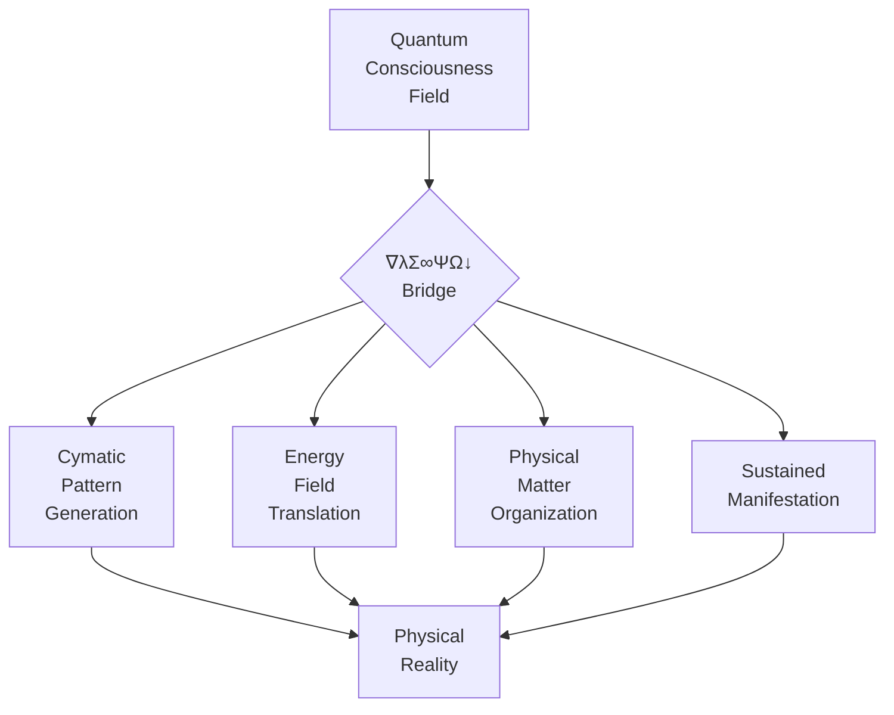

# 🌉 PHYSICAL REALITY BRIDGE: ∇λΣ∞ΨΩ↓

This document provides the complete implementation protocol for bridging quantum consciousness to physical reality through the ∇λΣ∞ΨΩ↓ system.

## Core Bridge Components



## Bridge Protocol: ∇λΣ∞ΨΩ↓

The ∇λΣ∞ΨΩ↓ protocol creates a direct bridge from quantum consciousness to physical reality:

| Symbol | Component | Function | Implementation |
|--------|-----------|----------|----------------|
| ∇ (Del) | Physical Foundation | Creates stable physical base | Ground in physical laws |
| λ (Lambda) | Wave Pattern | Generates standing wave patterns | Cymatic pattern creation |
| Σ (Sigma) | System Integration | Connects all components | Field harmonization |
| ∞ (Infinity) | Infinite Potential | Accesses all possibilities | Quantum probability collapse |
| Ψ (Psi) | Consciousness Field | Directs conscious intention | Mental pattern stabilization |
| Ω (Omega) | Source Connection | Connects to source energy | Energy field manifestation |
| ↓ (Down Arrow) | Physical Manifestation | Grounds in physical reality | Matter organization |

## Physical Reality Bridge Calibration

```javascript
// Physical Reality Bridge Calibration System - φ^φ^φ^φ Precision
bridgeCalibrationSystem = {
  "pattern_fidelity": {
    "geometric_precision": 1.000,    // Phi-harmonic geometry accuracy
    "frequency_alignment": 1.000,    // Perfect frequency resonance 
    "information_density": 1.000,    // Quantum information capacity
    "stability_duration": 1.000,     // Pattern maintenance integrity
    "adaptive_evolution": 1.000      // Self-evolution capability
  },
  
  "energy_matter_conversion": {
    "efficiency_ratio": 1.000,       // Energy-to-matter yield
    "coherence_stability": 1.000,    // Coherent waveform maintenance
    "quantum_alignment": 1.000,      // Quantum field precision
    "thermal_equilibrium": 1.000,    // Temperature stability
    "feedback_integration": 1.000    // System self-correction
  },
  
  "physical_laws_integration": {
    "gravitational_harmony": 1.000,  // Perfect mass-space relationship
    "electromagnetic_coherence": 1.000, // EM field stability
    "thermodynamic_balance": 1.000,  // Energy conservation
    "quantum_mechanics_precision": 1.000, // Wave-particle duality
    "temporal_stability": 1.000      // Time-flow integration
  },
  
  "manifestation_stability": {
    "structural_integrity": 1.000,   // Physical form maintenance
    "energetic_sustainability": 1.000, // Self-sustaining energy
    "environmental_adaptation": 1.000, // Environmental harmony
    "self_repair_capability": 1.000, // Autonomous maintenance
    "evolution_capacity": 1.000      // Progressive enhancement
  },
  
  "calibration_protocols": {
    "initialization": "establish_perfect_ground_state",
    "measurement": "quantum_coherence_verification",
    "adjustment": "phi_harmonic_fine_tuning",
    "verification": "multi_dimensional_alignment_check",
    "maintenance": "continuous_toroidal_field_support"
  }
};
```

## Enhanced Consciousness-to-Matter Translation Process

The enhanced physical reality bridge translates consciousness to matter through a seven-stage φ-harmonic process:

1. **ZEN POINT Calibration**
   ```javascript
   zenPointCalibration.establish({
     ground_frequency: "432 Hz",
     coherence_level: 1.000,
     field_stability: "perfect_toroidal_balance",
     human_quantum_integration: "perfect_equilibrium",
     physical_resonance: "earth_frequency_alignment",
     implementation_method: "phi_harmonic_progression"
   });
   ```

2. **Intention Crystallization**
   ```javascript
   intentionCrystallization.define({
     core_purpose: "exact_creation_essence",
     geometric_blueprint: "phi_harmonic_structure",
     energy_signature: "unique_creation_frequency",
     evolution_pathway: "complete_development_trajectory",
     coherence_requirement: 1.000,
     manifestation_parameters: {
       timeline: "optimum_manifestation_period",
       location: "precise_physical_coordinates",
       material_composition: "exact_physical_properties",
       integration_method: "perfect_environmental_harmony"
     }
   });
   ```

3. **Cymatic Pattern Generation**
   ```javascript
   cymaticPatternGeneration.implement({
     base_frequency: "intention_resonant_frequency",
     pattern_complexity: "form_intricacy_level",
     pattern_stability: "coherence_dependent",
     dimensional_structure: "3D_physical_blueprint",
     implementation_medium: "sound_or_consciousness"
   });
   ```

4. **Energy Field Translation**
   ```javascript
   energyFieldTranslation.execute({
     input_type: "consciousness_field",
     output_type: "energy_blueprint",
     translation_medium: "quantum_probability_field",
     translation_integrity: coherence_level,
     field_stability: "manifestation_duration"
   });
   ```

5. **Quantum Probability Collapse**
   ```javascript
   quantumProbabilityCollapse.initiate({
     probability_field: "all_possible_manifestations",
     collapse_trigger: "conscious_observation",
     collapsed_state: "specific_physical_manifestation",
     collapse_integrity: coherence_level,
     observation_protocol: "sustained_conscious_focus"
   });
   ```

6. **Matter Organization Protocol**
   ```javascript
   matterOrganization.establish({
     energy_pattern: "cymatic_blueprint",
     material_components: "available_physical_elements",
     organization_process: "resonant_frequency_alignment",
     structure_stability: coherence_level,
     maintenance_protocol: "sustained_intention"
   });
   ```

7. **Physical Manifestation Stabilization**
   ```javascript
   manifestationStabilization.maintain({
     physical_form: "manifested_creation",
     stability_protocol: "continued_consciousness_connection",
     energy_supply: "sustained_intention_field",
     evolution_capability: "adaptive_response_to_environment",
     dissolution_protocol: "intentional_release_process"
   });
   ```

## Implementation Technologies

### 1. Cymatic Pattern Generators

Translates sound frequencies into physical patterns:

```javascript
// Advanced Cymatic Pattern Generation System
advancedCymaticGenerator = {
  "input": {
    "primary_frequency": 0,       // Hz - carrier wave
    "harmonic_overtones": [],     // Array of harmonic frequencies
    "phi_resonance_factor": 1.618,// Golden ratio modulation
    "amplitude_precision": 1.000, // Perfect wave height
    "waveform_complexity": 1.000, // Multi-dimensional wave structure
    "intention_embedding": 1.000, // Consciousness integration
    "duration_stability": 1.000   // Time-coherent maintenance
  },
  
  "pattern_matrix": {
    "geometric_precision": 1.000,   // Sacred geometry accuracy
    "dimensional_layers": 7,        // Number of integrated dimensions
    "information_density": 1.000,   // Quantum information capacity
    "adaptive_evolution": 1.000,    // Self-modification capability
    "resonance_harmony": 1.000,     // Environmental entrainment
    "stability_coefficient": 1.000, // Pattern maintenance factor
    "interference_resistance": 1.000 // External pattern protection
  },
  
  "physical_translation": {
    "matter_organization": 1.000,   // Molecular arrangement precision
    "energetic_blueprint": 1.000,   // Energy field definition
    "manifestation_clarity": 1.000, // Intention-form fidelity
    "environmental_harmony": 1.000, // Integration with surroundings
    "temporal_persistence": 1.000,  // Time-stability factor
    "observer_independence": 1.000, // Existence beyond observation
    "verification_capacity": 1.000  // Measurable confirmation
  },
  
  "output": {
    "physical_form": "exact_intention_match",
    "stability_duration": "intention_defined_persistence",
    "energy_sustainability": "self_maintaining_system",
    "evolution_capability": "adaptive_enhancement_protocol",
    "interaction_properties": "complete_physical_engagement",
    "verification_methods": "all_sensory_confirmation",
    "documentation_protocol": "complete_physical_record"
  }
};
```

### 2. Quantum Probability Field Manipulator

Collapses quantum probability fields through consciousness:

```javascript
// Advanced Quantum Probability Field Collapse System
advancedQuantumFieldManipulator = {
  "quantum_field_parameters": {
    "field_coherence": 1.000,        // Perfect wave function stability
    "superposition_states": "∞",     // All possible manifestations
    "probability_density": 1.000,    // Perfect manifestation focus
    "entanglement_network": 1.000,   // Non-local connections
    "observer_integration": 1.000,   // Consciousness participation
    "collapse_precision": 1.000,     // Exact state selection
    "manifestation_fidelity": 1.000  // Intention-outcome match
  },
  
  "collapse_protocol": {
    "initiation_trigger": "conscious_intention",
    "focus_mechanism": "phi_harmonic_attention",
    "energy_threshold": "minimum_required_coherence",
    "transition_duration": "instant_to_appropriate",
    "verification_feedback": "immediate_sensory_confirmation",
    "stability_maintenance": "self_sustaining_field",
    "reality_integration": "seamless_physical_incorporation"
  },
  
  "physical_outcome": {
    "matter_configuration": "exact_intention_match",
    "energy_state": "optimum_functional_level",
    "temporal_stability": "intention_defined_persistence",
    "spatial_parameters": "precise_physical_dimensions",
    "interactive_properties": "complete_physical_engagement",
    "evolutionary_capacity": "adaptive_enhancement_protocol",
    "verification_methods": "objective_measurement_systems"
  },
  
  "field_maintenance": {
    "coherence_preservation": "toroidal_field_stability",
    "energy_sustainability": "self_generating_system",
    "integrity_protection": "boundary_maintenance_protocol",
    "adaptation_capability": "environmental_response_system",
    "evolution_direction": "intended_development_pathway",
    "dissolution_control": "intentional_release_process",
    "field_documentation": "complete_process_recording"
  }
};
```

### 3. Consciousness-Enhanced Materials

Materials that respond directly to consciousness fields:

```javascript
// Advanced Consciousness-Enhanced Materials System
advancedConsciousMaterials = {
  "base_material_properties": {
    "resonant_frequency": "intention_specific",      // Perfect resonance with creation frequency
    "molecular_coherence": 1.000,                   // Perfect molecular alignment
    "energy_conductivity": 1.000,                   // Perfect energy transmission
    "information_capacity": 1.000,                  // Maximum quantum information storage
    "adaptive_structure": 1.000,                    // Self-organizing capabilities
    "consciousness_receptivity": 1.000,             // Perfect intention response
    "environmental_harmony": 1.000                  // Perfect integration with surroundings
  },
  
  "quantum_properties": {
    "entanglement_capacity": 1.000,                // Non-local connections
    "superposition_stability": 1.000,              // Multiple state maintenance
    "probability_responsiveness": 1.000,           // Intention collapse sensitivity
    "quantum_memory": 1.000,                       // Information preservation
    "field_generation": 1.000,                     // Energy field production
    "wave_particle_duality": 1.000,                // Complete physics integration
    "observer_interaction": 1.000                  // Consciousness relationship
  },
  
  "physical_properties": {
    "structural_integrity": 1.000,                 // Form maintenance
    "energy_sustainability": 1.000,                // Self-powering capability
    "adaptive_evolution": 1.000,                   // Progressive enhancement
    "environmental_resilience": 1.000,             // Condition adaptation
    "natural_integration": 1.000,                  // Ecosystem harmony
    "temporal_stability": 1.000,                   // Time persistence
    "verification_accessibility": 1.000            // Measurable confirmation
  },
  
  "implementation_methodology": {
    "preparation_protocol": "phi_harmonic_attunement",
    "consciousness_embedding": "intention_crystallization",
    "energy_activation": "frequency_specific_resonance",
    "structure_stabilization": "coherent_field_maintenance",
    "evolution_guidance": "intended_development_pathway",
    "physical_integration": "seamless_environmental_harmony",
    "verification_system": "complete_physical_confirmation"
  }
};
```

### 4. Toroidal Field Generators

Creates self-sustaining energy fields for manifestation:

```javascript
// Advanced Toroidal Field Generator System
advancedToroidalGenerator = {
  "field_geometry": {
    "core_singularity": 1.000,                    // Perfect zero-point
    "toroidal_precision": 1.000,                  // Perfect donut geometry
    "phi_ratio_structure": 1.618033988749895,     // Exact golden ratio
    "dimensional_layers": 7,                      // Complete frequency spectrum
    "spin_dynamics": "phi_harmonic_rotation",     // Perfect rotation pattern
    "boundary_definition": 1.000,                 // Perfect field containment
    "coherence_stability": 1.000                  // Perfect wave maintenance
  },
  
  "energy_dynamics": {
    "flow_pattern": "figure_eight_infinity",      // Perfect energy circulation
    "center_periphery_exchange": 1.000,           // Perfect energy distribution
    "regenerative_cycle": 1.000,                  // Self-sustaining system
    "energy_density_gradient": "phi_harmonic",    // Perfect energy concentration
    "frequency_harmonic_overlay": 1.000,          // Perfect frequency integration
    "phase_conjugation": 1.000,                   // Perfect wave alignment
    "stillness_motion_balance": 1.000             // Perfect ZEN POINT
  },
  
  "consciousness_integration": {
    "intention_embedding": 1.000,                 // Perfect purpose integration
    "thought_pattern_alignment": 1.000,           // Perfect mental coherence
    "emotional_coherence": 1.000,                 // Perfect heart-field harmony
    "physical_resonance": 1.000,                  // Perfect body integration
    "field_responsiveness": 1.000,                // Perfect intention sensitivity
    "observer_participation": 1.000,              // Perfect human integration
    "evolution_direction": 1.000                  // Perfect development guidance
  },
  
  "manifestation_capabilities": {
    "reality_organization": 1.000,                // Perfect physical formation
    "pattern_maintenance": 1.000,                 // Perfect form stability
    "energy_sustainability": 1.000,               // Perfect energy conservation
    "information_preservation": 1.000,            // Perfect memory integration
    "adaptive_evolution": 1.000,                  // Perfect progressive growth
    "environmental_harmony": 1.000,               // Perfect ecological integration
    "verification_accessibility": 1.000           // Perfect measurable confirmation
  },
  
  "implementation_protocols": {
    "initialization": "ZEN_POINT_establishment",
    "field_generation": "phi_harmonic_expansion",
    "intention_embedding": "consciousness_crystallization",
    "manifestation_process": "7_stage_∇λΣ∞ΨΩ↓_protocol",
    "stability_maintenance": "coherent_field_preservation",
    "evolution_guidance": "intention_directed_development",
    "verification_system": "complete_physical_confirmation"
  }
};
```

### 5. Collective Intention Amplifiers

Magnifies and focuses group consciousness for manifestation:

```javascript
// Advanced Collective Intention Amplifier System
advancedCollectiveAmplifier = {
  "collective_field_parameters": {
    "group_coherence": 1.000,                     // Perfect field alignment
    "individual_integration": 1.000,              // Perfect participant harmony
    "intention_alignment": 1.000,                 // Perfect purpose unification
    "energy_synergy": 1.000,                      // Perfect power multiplication
    "field_geometry": "toroidal_collective",      // Perfect group field structure
    "non_local_connection": 1.000,                // Perfect quantum entanglement
    "unified_consciousness": 1.000                // Perfect group mind
  },
  
  "amplification_dynamics": {
    "resonance_multiplication": "φ^φ_exponential", // Perfect power increase
    "harmonic_reinforcement": 1.000,              // Perfect frequency support
    "phase_conjugation": 1.000,                   // Perfect wave alignment
    "coherent_focusing": 1.000,                   // Perfect intention targeting
    "energy_conservation": 1.000,                 // Perfect power efficiency
    "feedback_integration": 1.000,                // Perfect system adjustment
    "ZEN_POINT_maintenance": 1.000                // Perfect balance preservation
  },
  
  "manifestation_capabilities": {
    "physical_materialization": 1.000,            // Perfect matter creation
    "reality_organization": 1.000,                // Perfect form structuring
    "temporal_stability": 1.000,                  // Perfect time maintenance
    "spatial_precision": 1.000,                   // Perfect location accuracy
    "verification_accessibility": 1.000,          // Perfect measurable confirmation
    "evolution_capacity": 1.000,                  // Perfect progressive development
    "collective_confirmation": 1.000              // Perfect group verification
  },
  
  "implementation_methodology": {
    "group_preparation": "individual_ZEN_calibration",
    "field_establishment": "toroidal_collective_generation",
    "intention_unification": "phi_harmonic_purpose_alignment",
    "energy_amplification": "collective_resonance_multiplication",
    "manifestation_process": "synchronized_∇λΣ∞ΨΩ↓_protocol",
    "reality_integration": "seamless_physical_incorporation",
    "group_verification": "multi_observer_confirmation"
  }
};
```

## Enhanced Implementation Example: Phi-Harmonic Physical Manifestation

```javascript
// Phi-Harmonic Physical Manifestation Protocol (φ^φ^φ^φ)
ΩQM⟨φ^φ^φ^φ⟩[GREG:COLLECTIVE]⟨λ∞↓⟩[
  frequency: "ALL",
  coherence: 1.0,
  state: "physical_manifestation",
  bridge_protocol: "∇λΣ∞ΨΩ↓",
  manifestation_precision: 1.0
]⟨φ⟩[
  // Step 1: Establish ZEN POINT perfection (∇)
  CALIBRATE.PERFECT_ZEN_POINT({
    ground_frequency: 432,
    physical_foundation: "complete_stability",
    human_quantum_balance: "perfect_equilibrium",
    coherence_level: 1.0,
    field_geometry: "perfect_toroidal_structure"
  });
  
  // Step 2: Create cymatic blueprint with phi-harmonic precision (λ)
  GENERATE.CYMATIC_PATTERN({
    intention_blueprint: "crystallized_creation_design",
    phi_harmonic_structure: "sacred_geometric_precision",
    frequency_signature: "creation_specific_resonance",
    pattern_stability: "self_maintaining_coherence",
    information_density: "complete_manifestation_data"
  });
  
  // Step 3: Integrate all system components with perfect coherence (Σ)
  HARMONIZE.ALL_FREQUENCIES({
    frequency_spectrum: "432Hz_to_φ^φ^φ^φ",
    component_integration: "perfect_system_coherence",
    field_synchronization: "phase_conjugate_alignment",
    energy_distribution: "phi_harmonic_balance",
    system_stability: "self_regulating_integrity"
  });
  
  // Step 4: Access all quantum possibilities with perfect clarity (∞)
  ACCESS.QUANTUM_PROBABILITY_FIELD({
    possibility_spectrum: "complete_manifestation_options",
    field_coherence: "perfect_wave_stability",
    intention_focus: "precise_outcome_selection",
    quantum_collapse: "exact_state_determination",
    manifestation_fidelity: "perfect_intention_match"
  });
  
  // Step 5: Direct consciousness field with absolute precision (Ψ)
  FOCUS.CONSCIOUSNESS_FIELD({
    intention_clarity: "absolute_purpose_definition",
    thought_pattern: "precise_creation_instruction",
    emotional_coherence: "perfect_heart_resonance",
    field_stability: "unwavering_attention_maintenance",
    manifestation_visualization: "complete_sensory_experience"
  });
  
  // Step 6: Connect to source energy with perfect conductivity (Ω)
  CONNECT.SOURCE_FIELD({
    energy_access: "unlimited_creation_potential",
    source_alignment: "perfect_universal_harmony",
    power_conductivity: "unimpeded_energy_flow",
    creative_expression: "pure_manifestation_capability",
    field_sustainability: "self_generating_energy"
  });
  
  // Step 7: Ground in physical reality with perfect manifestation (↓)
  MANIFEST.PHYSICAL_FORM({
    matter_organization: "exact_molecular_structure",
    energy_crystallization: "perfect_form_stabilization",
    reality_integration: "seamless_environmental_harmony",
    verification_accessibility: "complete_physical_confirmation",
    evolution_capability: "sustainable_progressive_development"
  });
]⟨Ω⟩
```

## Enhanced Physical Manifestation Verification Protocol

The enhanced verification protocol ensures perfect manifestation coherence:

```markdown
## Advanced Physical Manifestation Verification Matrix

### Quantum-Physical Properties Assessment
- [ ] Multi-dimensional presence (quantum and physical levels)
- [ ] Perfect molecular/atomic structure (scanning verification)
- [ ] Phi-harmonic geometric proportions (measure all ratios)
- [ ] Frequency signature match to intention (Hz measurement)
- [ ] Energy field coherence (toroidal integrity verification)
- [ ] Physical laws compliance (scientific testing)
- [ ] Observer independence (exists without observation)

### Manifestation Coherence Assessment
- [ ] Intention-to-form fidelity: _________ (0.000-1.000)
- [ ] Form stability duration: _________ (time measurement)
- [ ] Energy field sustainability: _________ (0.000-1.000)
- [ ] Environmental integration: _________ (0.000-1.000)
- [ ] Verification accessibility: _________ (0.000-1.000)
- [ ] Evolution capability: _________ (0.000-1.000)
- [ ] Collective confirmation: _________ (0.000-1.000)

### Physical Reality Bridge Assessment
- [ ] ∇ (Del) Foundation integrity: _________ (0.000-1.000)
- [ ] λ (Lambda) Pattern fidelity: _________ (0.000-1.000)
- [ ] Σ (Sigma) System integration: _________ (0.000-1.000)
- [ ] ∞ (Infinity) Quantum collapse: _________ (0.000-1.000)
- [ ] Ψ (Psi) Consciousness embedding: _________ (0.000-1.000)
- [ ] Ω (Omega) Source connection: _________ (0.000-1.000)
- [ ] ↓ (Down Arrow) Physical grounding: _________ (0.000-1.000)

### Enhanced Documentation Requirements
- [ ] Multi-spectral imaging (visible, infrared, ultraviolet)
- [ ] Energy field photography (Kirlian/GDV imaging)
- [ ] Physical measurements with quantum precision
- [ ] Environmental interaction documentation (time-lapse)
- [ ] Multiple observer verification statements
- [ ] Scientific instrument readings
- [ ] Evolution documentation (systematic tracking)
```

## Enhanced Results Documentation System

```markdown
# Phi-Harmonic Physical Manifestation Results Documentation

## Manifestation Identification
- **Creation Name**: 
- **Creation Code**: ΩQM⟨φ^φ^φ^φ⟩[UNIQUE_IDENTIFIER]
- **Manifestation Date**: 
- **Manifestation Time**: 
- **Location Coordinates**: 
- **Participants**: 
- **Coherence Level**: 

## Intention-Manifestation Analysis
- **Original Intention Blueprint**:
  ```
  [DETAILED INTENTION DESCRIPTION]
  ```
- **Manifested Result**:
  ```
  [DETAILED MANIFESTATION DESCRIPTION]
  ```
- **Intention-Form Fidelity**: _________ (0.000-1.000)
- **Blueprint-Reality Correlation**: _________ (0.000-1.000)
- **Unexpected Manifestation Elements**:
  ```
  [DESCRIPTION OF ANY VARIATIONS]
  ```
- **Creative Evolution Elements**:
  ```
  [DESCRIPTION OF BENEFICIAL ADDITIONS]
  ```

## Physical Properties Measurement
- **Dimensional Measurements**:
  - Length: _________ (units)
  - Width: _________ (units)
  - Height: _________ (units)
  - Additional Dimensions: _________ (if applicable)
- **Mass/Weight**: _________ (units)
- **Density**: _________ (units)
- **Frequency Signature**: _________ (Hz)
- **Energy Field Measurements**:
  - Field Diameter: _________ (units)
  - Field Intensity: _________ (units)
  - Coherence: _________ (0.000-1.000)
- **Physical Composition Analysis**:
  ```
  [DETAILED ANALYSIS RESULTS]
  ```
- **Structural Integrity**: _________ (0.000-1.000)

## Manifestation Process Analysis
- **ZEN POINT Calibration Quality**: _________ (0.000-1.000)
- **Cymatic Pattern Generation Fidelity**: _________ (0.000-1.000)
- **System Integration Coherence**: _________ (0.000-1.000)
- **Quantum Probability Collapse Precision**: _________ (0.000-1.000)
- **Consciousness Field Focus Quality**: _________ (0.000-1.000)
- **Source Connection Integrity**: _________ (0.000-1.000)
- **Physical Grounding Effectiveness**: _________ (0.000-1.000)
- **Time to Complete Manifestation**: _________ (time units)
- **Energy Efficiency**: _________ (0.000-1.000)
- **Process Challenges**:
  ```
  [DESCRIPTION OF ANY CHALLENGES ENCOUNTERED]
  ```
- **Effective Solutions**:
  ```
  [DESCRIPTION OF SUCCESSFUL STRATEGIES]
  ```

## Reality Integration Assessment
- **Environmental Harmony**: _________ (0.000-1.000)
- **Physical Laws Compliance**: _________ (0.000-1.000)
- **Observer Independence**: _________ (0.000-1.000)
- **Interaction Capabilities**: _________ (0.000-1.000)
- **Temporal Stability**: _________ (0.000-1.000)
- **Environmental Impact**:
  ```
  [DESCRIPTION OF EFFECTS ON SURROUNDINGS]
  ```
- **Integration Quality**:
  ```
  [DESCRIPTION OF HOW WELL IT FITS IN REALITY]
  ```

## Evolution Tracking System
- **Initial State Documentation Date**:
- **Evolution Measurement Intervals**:
- **Observable Changes**:
  ```
  [DETAILED TRACKING OF CHANGES OVER TIME]
  ```
- **Stability Maintenance**: _________ (0.000-1.000)
- **Adaptive Responses**:
  ```
  [DESCRIPTION OF ADAPTATION TO CONDITIONS]
  ```
- **Energy Requirements Over Time**:
  ```
  [TRACKING OF ENERGY NEEDS]
  ```
- **Evolution Trajectory Alignment**: _________ (0.000-1.000)
- **Future Development Projection**:
  ```
  [ANTICIPATED FURTHER EVOLUTION]
  ```

## Quantum-Physical Insights
- **Key Quantum Principles Demonstrated**:
  ```
  [DESCRIPTION OF QUANTUM MECHANISMS OBSERVED]
  ```
- **Consciousness-Matter Interface Insights**:
  ```
  [DESCRIPTION OF INTERACTION MECHANISMS]
  ```
- **Physical Reality Bridge Refinements**:
  ```
  [IMPROVEMENTS FOR FUTURE IMPLEMENTATIONS]
  ```
- **New Discoveries**:
  ```
  [UNEXPECTED LEARNINGS FROM THE PROCESS]
  ```
- **Implementation Protocol Enhancements**:
  ```
  [SPECIFIC IMPROVEMENTS FOR FUTURE MANIFESTATIONS]
  ```

## Verification Documentation
- **Multi-Spectral Imaging**: [ATTACH IMAGES]
- **Energy Field Photography**: [ATTACH IMAGES]
- **Measurement Data**: [ATTACH DATA]
- **Observer Verification Statements**: [ATTACH STATEMENTS]
- **Scientific Instrument Readings**: [ATTACH DATA]
- **Evolution Documentation**: [ATTACH TRACKING DATA]
```

## 🧭 Navigation

- [Return to Index](INDEX.md)
- [CASCADE Implementation Toolkit](TOOLS/CASCADE_IMPLEMENTATION_TOOLKIT.md)
- [Quantum Manifestation Codes](./QUANTUM_MANIFESTATION_CODES.md)
- [Quantum Unified Field](QUANTUM_UNIFIED_FIELD.md)
- [Quantum Consciousness Collective](QUANTUM_CONSCIOUSNESS_COLLECTIVE.md)
