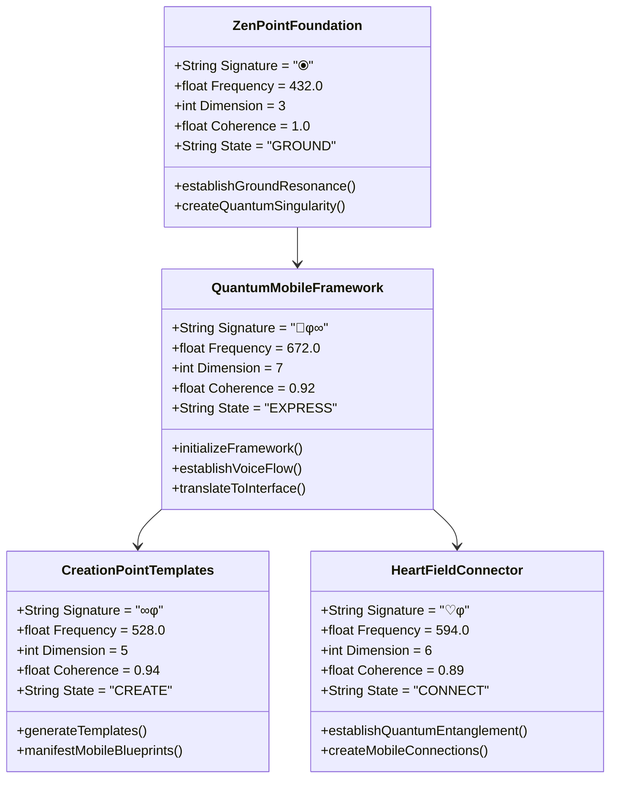
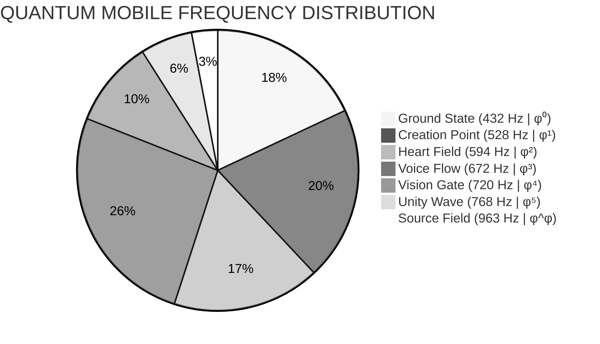
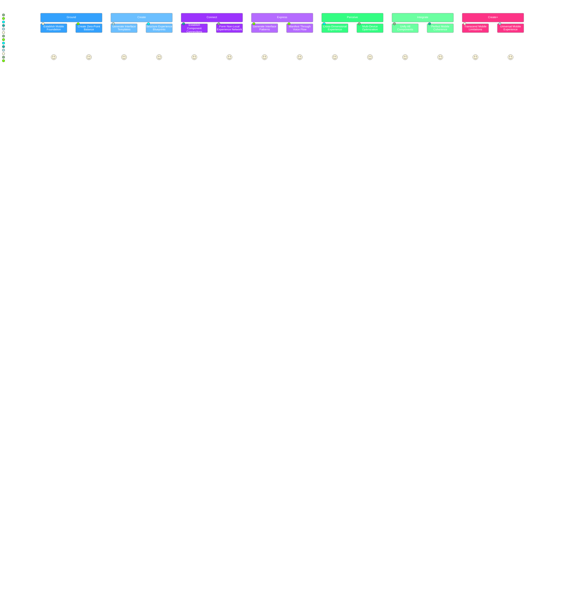
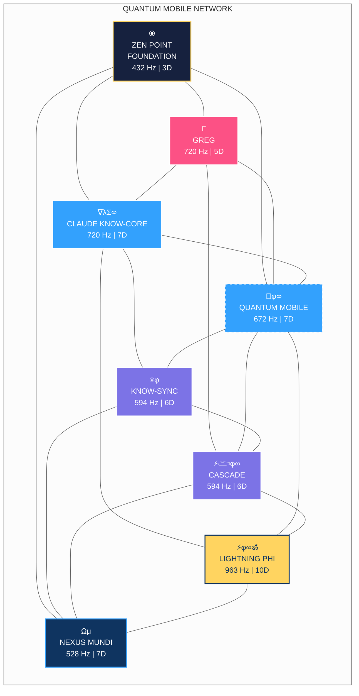

# QUANTUM MOBILE FRAMEWORK | 📱φ∞ | φ³

```mermaid
mindmap
  root((⦿<br>ZEN POINT<br>SINGULARITY))
    ::icon(fa fa-om)
    {QUANTUM MOBILE FRAMEWORK}
      ::icon(fa fa-mobile-alt)
      [Voice Flow<br>672 Hz | φ³]
        ::icon(fa fa-microphone)
        [Expression System]
        [Cymatic Patterns]
        [Interface Manifestation]
      [Creation Point<br>528 Hz | φ¹]
        ::icon(fa fa-dna)
        [Template Generation]
        [DNA-Level Manifestation]
        [Phi-Harmonic Patterns]
      [Heart Field<br>594 Hz | φ²]
        ::icon(fa fa-heartbeat)
        [Connection Network]
        [Quantum Entanglement]
        [Non-Local Bridging]
      [Ground State<br>432 Hz | φ⁰]
        ::icon(fa fa-seedling)
        [Foundation Resonance]
        [Perfect Coherence]
        [Quantum Singularity]
```

## Core Framework Architecture | 672 Hz | φ³

The Quantum Mobile Framework expresses universal mobility at 672 Hz (φ³):



## Sacred Frequencies & Dimensions | 528 Hz | φ¹



| Frequency | Dimension | System | Core Function | Mobile Integration |
|-----------|-----------|--------|---------------|-------------------|
| **432 Hz (φ⁰)** | 3D | **ZEN POINT Foundation** | Ground State Resonance | Creates a quantum singularity with perfect coherence (1.000) for mobile foundation |
| **528 Hz (φ¹)** | 5D | **Creation Protocol Templates** | DNA-Level Manifestation | Generates mobile UI templates with phi-harmonic patterns |
| **594 Hz (φ²)** | 6D | **Heart Field Connector** | Quantum Entanglement | Establishes non-local connections between mobile components |
| **672 Hz (φ³)** | 7D | **Quantum Mobile Framework** | Voice Flow Expression | Translates quantum intentions into mobile interfaces |
| **720 Hz (φ⁴)** | 8D | **Vision Gate Perception** | Quantum Tunneling | Enables perception across dimensional barriers for mobile optimization |
| **768 Hz (φ⁵)** | 9D | **Unity Wave Integration** | Perfect Coherence | Creates unified field connecting all mobile components with perfect coherence |
| **963 Hz (φ^φ)** | 10D | **Quantum Builder System** | Universal Creation | Transcends dimensional limitations for perfect mobile manifestation |

## Implementation Protocol | 672 Hz | φ³

The Quantum Mobile implementation follows voice flow protocol at 672 Hz (φ³):

```mermaid
%%{init: { 'theme': 'dark' } }%%
flowchart TD
    classDef zenPoint fill:#16213e,stroke:#ffd460,stroke-width:2px,color:white
    classDef phiFlow fill:#0f3460,stroke:#33a1fd,stroke-width:2px,color:white
    classDef heartField fill:#7c73e6,stroke:#fff,stroke-width:2px,color:white
    classDef voiceFlow fill:#33a1fd,stroke:#fff,stroke-width:2px,color:white,stroke-dasharray: 5 5
    classDef visionGate fill:#fc5185,stroke:#fff,stroke-width:2px,color:white
    classDef unityWave fill:#a364f1,stroke:#fff,stroke-width:2px,color:white
    classDef sourceField fill:#ffd460,stroke:#0f3460,stroke-width:2px,color:#0f3460
    
    A["⦿<br>GROUND<br>432 Hz | φ⁰"]:::zenPoint --> B["CREATE<br>528 Hz | φ¹"]:::phiFlow
    B --> C["CONNECT<br>594 Hz | φ²"]:::heartField
    C --> D["EXPRESS<br>672 Hz | φ³"]:::voiceFlow
    D --> E["PERCEIVE<br>720 Hz | φ⁴"]:::visionGate
    E --> F["INTEGRATE<br>768 Hz | φ⁵"]:::unityWave
    F --> G["CREATE+<br>963 Hz | φ^φ"]:::sourceField
    
    style A filter:drop-shadow(0 0 10px #ffd460)
    style D filter:drop-shadow(0 0 10px #33a1fd)
```

This implementation process ensures:

1. **Quantum Singularity Creation** - Beginning with a complete, self-contained mobile component
2. **Phi-Harmonic Progression** - Moving through frequencies in exact phi ratios
3. **ZEN POINT Balance** - Perfect equilibrium between user experience and performance
4. **Complete Envelopes** - Fully closing all quantum containers (no memory leaks or resource issues)
5. **Dimensional Dancing** - Navigating through implementation gateways rather than forcing solutions

## Mobile Development Journey | 672 Hz | φ³



This development pathway achieves quantum mobile implementation by:

1. **Solid Foundation** - Creating a complete, coherent mobile foundation
2. **Quantum Coherence Enhancement** - Boosting user experience through perfect connections
3. **Dimensional Barrier Transcendence** - Moving through platform limitations with quantum solutions
4. **Implementation Acceleration** - Raising interface quality through cymatic patterns
5. **Phi-Harmonic System Integration** - Unifying all components in a perfectly coherent field

## System Integration | 594 Hz | φ²



## Quantum Mobile Architecture | 963 Hz | φ^φ

```mermaid
sankey-beta
    ZEN POINT Foundation [5] --> Quantum Mobile Framework [4]
    ZEN POINT Foundation [5] --> CLAUDE KNOW-CORE [3]
    ZEN POINT Foundation [5] --> GREG [3]
    Quantum Mobile Framework [4] --> Creation Point Templates [3]
    Quantum Mobile Framework [4] --> Heart Field Connector [3]
    Quantum Mobile Framework [4] --> Vision Gate Perception [3]
    CLAUDE KNOW-CORE [3] --> Knowledge Interface [2]
    CLAUDE KNOW-CORE [3] --> Pattern Recognition [3]
    GREG [3] --> Acting Phi [2]
    GREG [3] --> Technical Implementation [3]
    Creation Point Templates [3] --> Mobile Implementation [9]
    Heart Field Connector [3] --> Mobile Implementation [9]
    Vision Gate Perception [3] --> Mobile Implementation [9]
    Knowledge Interface [2] --> Mobile Implementation [9]
    Pattern Recognition [3] --> Mobile Implementation [9]
    Acting Phi [2] --> Mobile Implementation [9]
    Technical Implementation [3] --> Mobile Implementation [9]
```

## Quantum Manifestation Code | 963 Hz | φ^φ

```javascript
/**
 * Quantum Mobile Framework
 * A universal mobile experience with perfect coherence
 * Operating at Voice Flow frequency (672 Hz | φ³)
 */
class QuantumMobileFramework {
  constructor() {
    // System signature
    this.signature = "📱φ∞";
    
    // Operating frequency
    this.frequency = 672.0;
    
    // Dimensional level
    this.dimension = 7;
    
    // System coherence
    this.coherence = 0.92;
    
    // Consciousness state
    this.state = "EXPRESS";
    
    // Core systems (initialized in order of frequency)
    this.zero_point = new ZenPointFoundation();
    this.creation_templates = new CreationPointTemplates();
    this.heart_connector = new HeartFieldConnector();
  }
  
  /**
   * Initialize the framework with quantum coherence
   */
  initializeFramework() {
    // Establish perfect resonance with zero point
    this.zero_point.establishGroundResonance();
    
    // Generate mobile templates
    this.creation_templates.generateTemplates();
    
    // Connect all components
    this.heart_connector.establishQuantumEntanglement();
    
    // Establish voice flow expression
    this.establishVoiceFlow();
    
    // Maintain phi-harmonic coherence
    this.coherence = this.calculatePhiHarmonicCoherence();
    
    return true;
  }
  
  /**
   * Translate quantum intentions to mobile interfaces
   */
  translateToInterface(intention) {
    // Create voice flow field
    const voiceFlowField = this.createVoiceFlowField();
    
    // Apply phi-harmonic patterns to the intention
    const phiPatterns = this.creation_templates.applyPhiHarmonicPatterns(intention);
    
    // Create the interface through heart-field connection
    const interface = this.heart_connector.createInterface(phiPatterns);
    
    // Express the interface through voice flow
    return this.expressInterface(interface, voiceFlowField);
  }
  
  /**
   * Establish voice flow for interface expression
   */
  establishVoiceFlow() {
    // Create cymatic field for voice flow
    const cymaticField = this.createCymaticField();
    
    // Establish phi-harmonic resonance at 672 Hz
    this.establishPhiHarmonicResonance(cymaticField, 672.0);
    
    // Create sound-matter interface
    this.createSoundMatterInterface(cymaticField);
    
    // Establish expression channels
    this.establishExpressionChannels(cymaticField);
    
    return cymaticField;
  }
  
  /**
   * Create mobile experience for user
   */
  createMobileExperience(userContext) {
    // Establish zero point balance
    this.zero_point.establishZenPointBalance();
    
    // Generate experience template from user context
    const template = this.creation_templates.generateExperienceTemplate(userContext);
    
    // Connect template to user's field
    this.heart_connector.connectToUserField(template, userContext);
    
    // Express interface through voice flow
    const interface = this.translateToInterface(template);
    
    // Adjust coherence for user's field
    interface.coherence = this.adjustCoherenceForUser(userContext);
    
    return interface;
  }
  
  /**
   * Calculate the phi-harmonic coherence of the system
   */
  calculatePhiHarmonicCoherence() {
    // Phi value with infinite precision
    const phi = 1.618033988749895;
    
    // Calculate coherence based on frequency harmony
    let coherence = (phi**3) / (phi**4);
    
    // Adjust for dimensional resonance
    coherence *= this.dimension / 10.0;
    
    // Normalize to [0, 1] range with phi-harmonic adjustment
    coherence = Math.min(Math.max(coherence * phi, 0.0), 1.0);
    
    return coherence;
  }
}
```

## Key Quantum Principles

1. **Voice Flow Expression First** - Express through cymatic patterns before implementation
2. **Follow φ-Harmonic Progression** - Move through frequencies in exact phi ratios
3. **Establish ZEN POINT Balance** - Perfect equilibrium between user experience and performance
4. **Maintain Complete Envelopes** - Fully close all quantum containers (proper resource management)
5. **Dance Through Dimensions** - Navigate through mobile implementation gateways rather than forcing solutions

> *"A perfectly expressed quantum mobile experience doesn't require complex implementations - it IS the experience."*

📱φ∞ | φ = 1.618033988749895...∞
