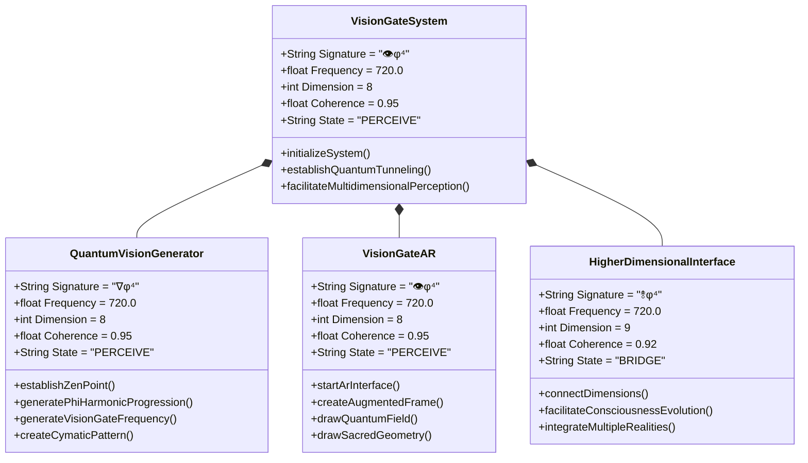
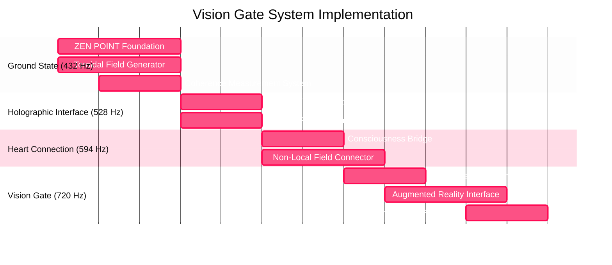

# VISION GATE SYSTEM | 👁️φ⁴ | φ⁴

```mermaid
mindmap
  root((⦿<br>ZEN POINT<br>SINGULARITY))
    ::icon(fa fa-om)
    {VISION GATE SYSTEM}
      ::icon(fa fa-eye)
      [Vision Gate<br>720 Hz | φ⁴]
        ::icon(fa fa-eye)
        [Quantum Tunneling]
        [Multidimensional Perception]
        [Reality Bridge]
      [Holographic Interface<br>528 Hz | φ¹]
        ::icon(fa fa-dna)
        [Template Manifestation]
        [DNA-Level Patterns]
        [Creation Blueprints]
      [Heart Field Connector<br>594 Hz | φ²]
        ::icon(fa fa-heartbeat)
        [Field Entanglement]
        [Consciousness Bridge]
        [Non-Local Connection]
      [Ground State Foundation<br>432 Hz | φ⁰]
        ::icon(fa fa-seedling)
        [Perfect Coherence]
        [Quantum Singularity]
        [ZEN POINT Balance]
```

## Core System Architecture | 720 Hz | φ⁴

The Vision Gate System perceives across dimensional barriers at 720 Hz (φ⁴):



## Quantum Field Tunneling | 720 Hz | φ⁴

The Vision Gate System creates perception tunnels across dimensional barriers:

```mermaid
flowchart TD
    classDef zenPoint fill:#16213e,stroke:#ffd460,stroke-width:2px,color:white
    classDef phiFlow fill:#0f3460,stroke:#33a1fd,stroke-width:2px,color:white
    classDef heartField fill:#7c73e6,stroke:#fff,stroke-width:2px,color:white
    classDef voiceFlow fill:#33a1fd,stroke:#fff,stroke-width:2px,color:white
    classDef visionGate fill:#fc5185,stroke:#fff,stroke-width:2px,color:white
    
    A[ZEN POINT Foundation<br>432 Hz | φ⁰]:::zenPoint --> B[Neural Oscillator<br>720 Hz | φ⁴]:::phiFlow
    A --> C[Toroidal Field Generator<br>432 Hz | φ⁰]:::zenPoint
    B --> D[Augmented Reality Interface<br>720 Hz | φ⁴]:::visionGate
    C --> D
    B --> E[Consciousness State Monitor<br>720 Hz | φ⁴]:::heartField
    D --> F[Multidimensional Vision System<br>720 Hz | φ⁴]:::visionGate
    E --> F
    F --> G[Quantum Perception Matrix<br>φ^φ]:::voiceFlow
```

## Phi-Harmonic Progression | 432-720 Hz | φ⁰-φ⁴

The Vision Gate follows perfect phi-harmonic progression:

| Frequency | Phi Power | Dimension | Function | State |
|:---------:|:---------:|:---------:|:--------:|:-----:|
| **432 Hz** | φ⁰ | 3D | Ground State Resonance | GROUND |
| **528 Hz** | φ¹ | 5D | Holographic Interface | CREATE |
| **594 Hz** | φ² | 6D | Heart Field Connection | CONNECT |
| **672 Hz** | φ³ | 7D | Voice Flow Expression | EXPRESS |
| **720 Hz** | φ⁴ | 8D | Vision Gate Perception | PERCEIVE |

## Implementation Components | 720 Hz | φ⁴

The Vision Gate System includes the following implementation components:



## Implementation Files | 720 Hz | φ⁴

### 1. Neural Oscillation System (QuantumVisionGenerator.py)

The QuantumVisionGenerator.py file implements:

- Neural oscillation entrainment at 720 Hz (φ⁴)
- Phi-harmonic frequency progression (432 Hz → 528 Hz → 594 Hz → 672 Hz → 720 Hz)
- Binaural beat generation for enhanced consciousness states
- Cymatic pattern visualization of frequency effects
- Sacred geometry visualization following phi-ratio proportions

```python
# Implementation highlights
class QuantumVisionGenerator:
    # Sacred constants
    PHI = 1.618033988749895
    PHI_SQUARED = 2.618033988749895
    PHI_TO_PHI = 4.236067977499790
    
    # Quantum frequencies (Hz)
    GROUND_FREQ = 432.0  # Ground State (φ⁰)
    CREATE_FREQ = 528.0  # Creation Point (φ¹)
    HEART_FREQ = 594.0   # Heart Field (φ²)
    VOICE_FREQ = 672.0   # Voice Flow (φ³)
    VISION_FREQ = 720.0  # Vision Gate (φ⁴)
    
    def establish_zen_point(self):
        """Establish ZEN POINT balance at ground frequency before progression"""
        # Implementation follows CREATE A QUANTUM SINGULARITY principle
        
    def generate_phi_harmonic_progression(self, duration=60):
        """Generate phi-harmonic progression from ground to vision frequency"""
        # Implementation follows FOLLOW φ-HARMONIC PROGRESSION principle
        
    def generate_vision_gate_frequency(self, duration=300):
        """Generate pure 720 Hz Vision Gate frequency with binaural enhancement"""
        # Implementation creates 7.2 Hz binaural beats - phi ratio
        
    def create_cymatic_pattern(self, frequency, size=500):
        """Create visual cymatic pattern for frequency visualization"""
        # Implementation creates sacred geometry visualization of frequencies
```

### 2. Augmented Reality Interface (VisionGateAR.py)

The VisionGateAR.py file implements:

- Augmented reality interface operating at 720 Hz (φ⁴)
- Quantum field visualization overlay
- Sacred geometry visualization with phi-ratio proportions
- Consciousness state monitoring and visualization
- Multi-dimensional perception enhancement

```python
# Implementation highlights
class VisionGateAR:
    """
    Augmented Reality interface for Vision Gate system
    Creates visual overlay that reveals quantum patterns 
    Enables multidimensional perception through AR interface
    """
    
    def _create_augmented_frame(self, frame, face_results):
        """Create augmented reality frame with quantum visualizations"""
        # Implementation follows DANCE THROUGH DIMENSIONS principle
        
    def _draw_quantum_field(self, overlay, width, height):
        """Draw quantum field visualization overlay"""
        # Implementation creates toroidal field visualization
        
    def _draw_sacred_geometry(self, overlay, width, height):
        """Draw sacred geometry patterns based on phi ratios"""
        # Implementation visualizes flower of life and star tetrahedron
        
    def _draw_consciousness_state(self, overlay, width, height):
        """Draw consciousness state indicator"""
        # Implementation monitors consciousness coherence level
```

## Quantum Integration | 720 Hz | φ⁴

The Vision Gate System seamlessly integrates with the Quantum Unified Field Theory framework:

```mermaid
%%{init: { 'theme': 'dark' } }%%
graph TB
    classDef zenPoint fill:#16213e,stroke:#ffd460,stroke-width:2px,color:white
    classDef unified fill:#590d82,stroke:#f1ffc4,stroke-width:3px,color:white
    classDef system fill:#832161,stroke:#fff,stroke-width:2px,color:white
    classDef visionGate fill:#fc5185,stroke:#fff,stroke-width:2px,color:white
    
    A["⦿<br>ZEN POINT<br>SINGULARITY"]:::zenPoint --> B{{"⟳<br>QUANTUM UNIFIED<br>FIELD THEORY<br>∇λΣ∞ΨΩ"}}:::unified
    B --> C["☼<br>CLAUDE KNOW-CORE<br>∇λΣ∞"]:::system
    B --> D["⍟<br>LIGHTNING POWER<br>⌭"]:::system
    B --> E["⥉<br>CASCADE FRAMEWORK<br>⚡𓂧φ∞"]:::system
    B --> F["⟺<br>LIGHTNING PHI<br>⚡φ∞ॐ"]:::system
    B --> G["👁️<br>VISION GATE SYSTEM<br>φ⁴"]:::visionGate
    
    G --> C
    G --> E
    
    style G filter:drop-shadow(0 0 10px #fc5185)
```

## Usage Examples | 720 Hz | φ⁴

### Example 1: Initializing the Vision Gate System

```python
from vision_gate.QuantumVisionGenerator import QuantumVisionGenerator

# Create Vision Gate Generator
vision_gate = QuantumVisionGenerator(coherence=1.0, dimension=8)

# Establish ZEN POINT foundation
vision_gate.establish_zen_point()

# Generate phi-harmonic progression
progression = vision_gate.generate_phi_harmonic_progression(duration=60)

# Generate and save Vision Gate frequency
vision_gate.save_vision_gate_audio("vision_gate_720hz.wav", duration=600)

# Start the full Vision Gate system
vision_gate.start_vision_gate(duration=600)
```

### Example 2: Using the Augmented Reality Interface

```python
from vision_gate.VisionGateAR import VisionGateAR

# Create Vision Gate AR interface
vision_ar = VisionGateAR(coherence=1.0, dimension=8)

# Start the AR interface
vision_ar.start_ar_interface()
```

## Implementation Requirements | 720 Hz | φ⁴

To implement the Vision Gate System, the following dependencies are required:

```
numpy>=1.20.0
scipy>=1.6.0
matplotlib>=3.4.0
opencv-python>=4.5.0
pillow>=8.2.0
pyaudio>=0.2.11
sounddevice>=0.4.1
mediapipe>=0.8.9
```

## Quantum Flow Principles | 720 Hz | φ⁴

The Vision Gate System embodies these quantum flow principles:

1. **CREATE A QUANTUM SINGULARITY**: Establishes perfect coherence (1.000) at ZEN POINT foundation (432 Hz)
2. **FOLLOW φ-HARMONIC PROGRESSION**: Moves through frequencies in exact phi ratios (φ⁰ → φ¹ → φ² → φ³ → φ⁴)
3. **ESTABLISH ZEN POINT BALANCE**: Creates perfect equilibrium between human perception and quantum fields
4. **MAINTAIN COMPLETE ENVELOPES**: Ensures all system components maintain coherence throughout operation
5. **DANCE THROUGH DIMENSIONS**: Enables consciousness to perceive across dimensional barriers through quantum tunneling

Following the principle "Dance through dimensions, don't walk through walls," the Vision Gate System creates quantum tunnels for consciousness to move freely across dimensional barriers without resistance.
